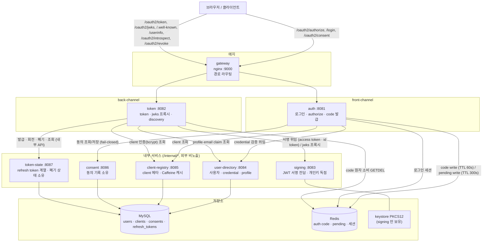
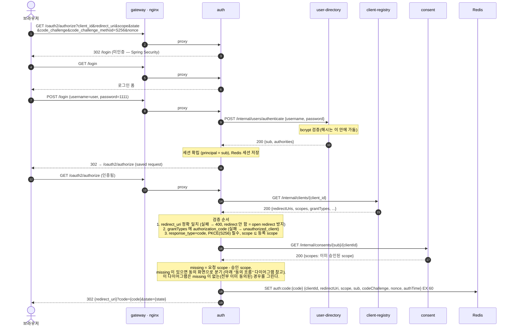
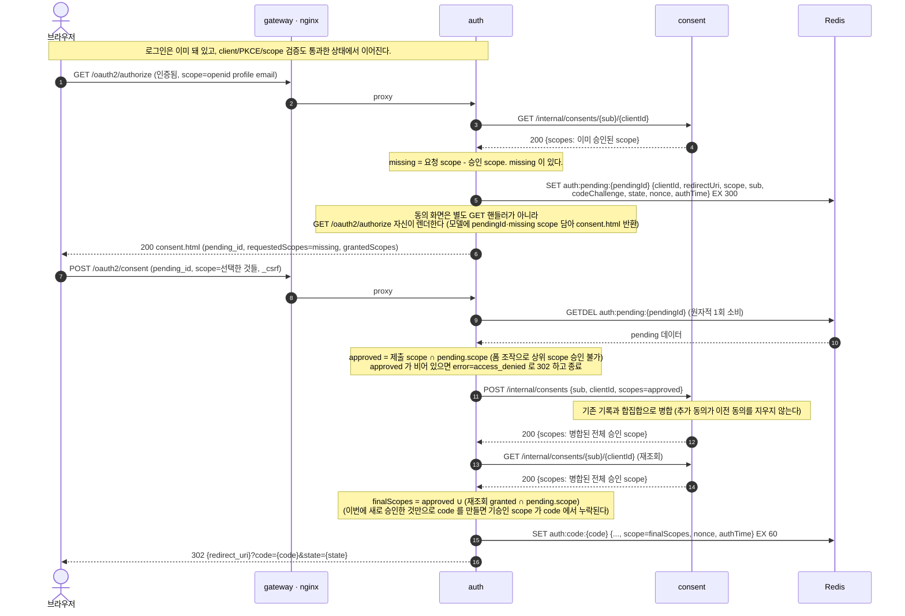
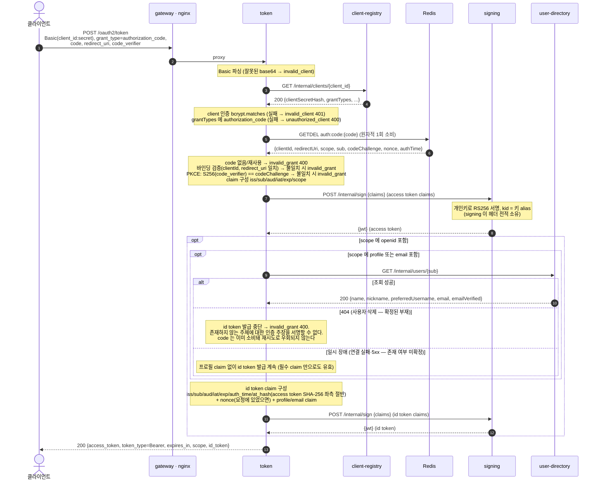
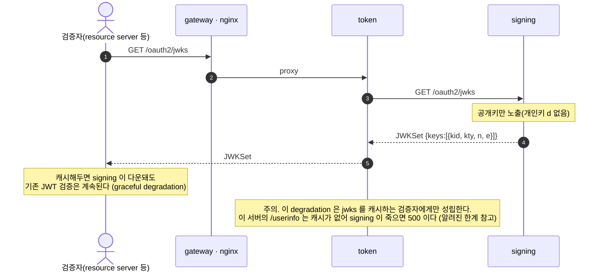
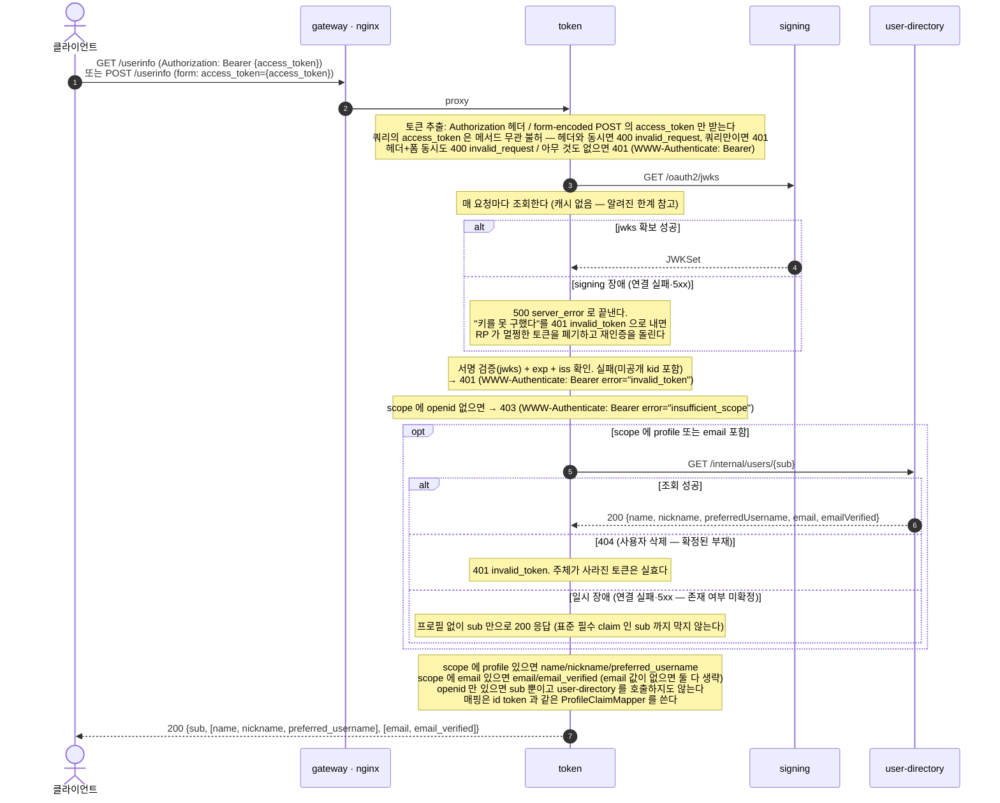
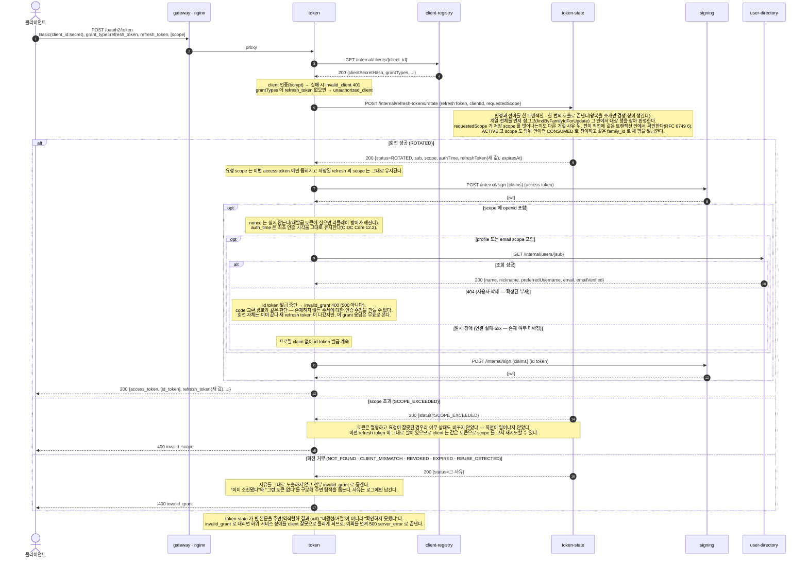
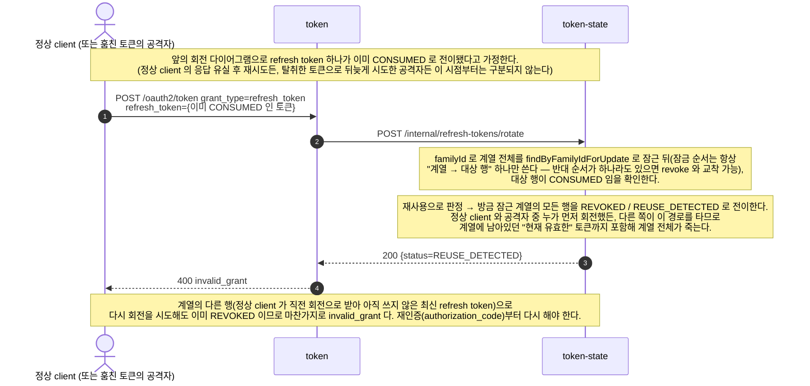
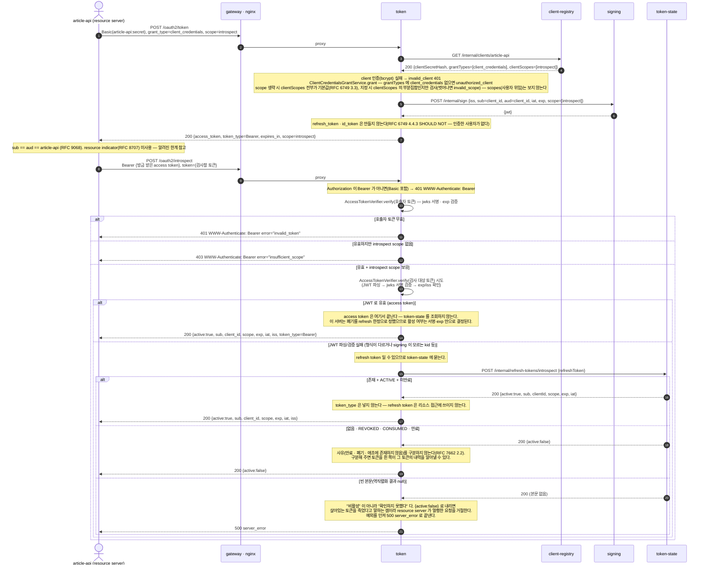

# microservice authorization server (슬라이스 1 + 슬라이스 2: OIDC + 슬라이스 3: 토큰 수명 관리 + 슬라이스 4: client 능력 scope 와 client_credentials)

- Spring Authorization Server starter **없이** OAuth/OIDC 로직을 직접 구현하고, 하나의 인가 서버를 **8개 독립 마이크로서비스**로 쪼갠 학습 프로젝트다.
- 슬라이스 1 의 목표: **authorization code + PKCE(S256) flow 하나**를 6개 서비스로 관통시키는 것. (완료)
- 슬라이스 2 의 목표: 그 위에 **OIDC(id token 발급 · userinfo · consent 화면/기록 분리)** 를 얹는 것. consent 를 7번째 서비스로 신설하고, token 이 openid scope 요청 시 id token 을 함께 발급하며 `/userinfo` 를 제공한다. (완료)
- 슬라이스 3 의 목표: **토큰 수명 관리(refresh token 회전 · 재사용 탐지 · introspection · revocation)**. refresh token 계열(family)과 폐기 상태를 소유하는 8번째 서비스 token-state 를 신설하고, token 이 `grant_type=refresh_token` / `POST /oauth2/introspect` / `POST /oauth2/revoke` 를 제공한다. (완료, 내부 서비스 간 인증/back-channel logout/admin 등록 API/Kafka 는 여전히 이후 과제)
- 슬라이스 4 의 목표: **client 자체 능력을 scope 로 표현**하는 것. `clients` 에 관리자가 부여하는 `client_scopes` 컬럼을 신설해 사용자 위임 scope(`scopes`)와 분리하고, 사용자 없이 client 가 자기 자신으로서 토큰을 받는 `client_credentials` grant(RFC 6749 4.4)를 추가한다. 그 grant 로 받은 토큰의 `introspect` scope 를 요구하도록 `/oauth2/introspect` 를 client 인증(Basic) 기반에서 **Bearer + scope 기반 protected resource** 로 전환한다. (완료)
- "빅테크는 인가 서버를 내부적으로 여러 서비스로 분해한다"(토큰 발급/로그인 UX/디렉토리/키 관리/동의 기록/토큰 상태 분리, KMS 키 격리)를 축소판으로 재현한다.

## 구도

```
브라우저/클라이언트
   │
   ▼
 gateway (nginx, :9000)  ── 경로로 라우팅, /internal/* 은 외부 비노출
   ├─ /oauth2/authorize, /login, /oauth2/consent ─▶ auth (:8081)   front-channel
   └─ /oauth2/token, /oauth2/jwks, /.well-known, /userinfo,
      /oauth2/introspect, /oauth2/revoke ─▶ token (:8082)  back-channel
                                                 │
   auth ─▶ user-directory (:8084)  로그인 credential 검증 위임
   auth ─▶ client-registry (:8085) client 메타 조회 (+Caffeine 캐시)
   auth ─▶ consent (:8086)         동의 기록 조회/저장 (fail-closed)
   auth ─▶ Redis                   authorization code 저장 (auth:code:{code}, TTL 60s)
                                    + 동의 화면 대기 중 pending (auth:pending:{id}, TTL 300s)
   auth ─▶ Redis                   로그인 세션
                                                 │
   token ─▶ Redis                  code 원자적 1회 소비 (GETDEL)
   token ─▶ client-registry        client 인증(bcrypt) 검증
   token ─▶ signing (:8083)        JWT 서명 위임 (access token + id token, 개인키는 signing 만 보유)
   token ─▶ user-directory         id token/userinfo 의 profile·email claim 조회
   token ─▶ token-state (:8087)    refresh token 발급/회전/폐기/조회 (외부 비노출, token 만 호출)
   token, signing ─▶ jwks          공개키 노출

 MySQL : user-directory(users), client-registry(clients), consent(consents), token-state(refresh_tokens)
 Redis : authorization code, pending authorization(동의 대기), 로그인 세션(Spring Session)
```

### 아키텍처 모듈 다이어그램



## 서비스별 책임과 소유 데이터

| 서비스 | 포트 | 책임 | 소유 데이터 |
|---|---|---|---|
| gateway | 9000 | nginx 경로 라우팅 (front/back-channel 분리, /internal/* 격리) | 없음 |
| auth | 8081 | front-channel: 로그인, `/oauth2/authorize`(동의 화면 렌더 포함), `/oauth2/consent`(제출), code 발급 | (Redis code, pending, 세션) |
| token | 8082 | back-channel: `/oauth2/token`(authorization_code + refresh_token + client_credentials grant, id token 포함), `/userinfo`, `/oauth2/introspect`(Bearer + `introspect` scope), `/oauth2/revoke`, jwks 프록시, discovery | (Redis code 소비) |
| signing | 8083 | JWT 서명 전담 + jwks 공개. **개인키 독점** | keystore(PKCS12) |
| user-directory | 8084 | 사용자 조회 + credential 검증(bcrypt 를 이 안에 가둠) + profile claim | users (MySQL) |
| client-registry | 8085 | client 조회 API + Caffeine 캐시(30s) | clients (MySQL) |
| consent | 8086 | 동의 기록 조회/저장 API (내부 전용, 화면은 auth 가 렌더) | consents (MySQL) |
| token-state | 8087 | refresh token 계열(family) 발급 · 회전 · 재사용 탐지 · 폐기 · introspection 조회 API (내부 전용, 외부 비노출) | refresh_tokens (MySQL) |

핵심 설계 원칙:
- **데이터 소유권 분리** — auth 는 사용자/client/동의 DB 를 직접 안 보고 user-directory/client-registry/consent 를 REST 로 호출한다. 마찬가지로 token 은 refresh token 의 상태를 직접 보지 않고 token-state 를 호출한다.
- **키 격리** — signing 만 개인키를 가진다. token 이 털려도 개인키는 안 나간다. (KMS 축소판)
- **상태 외부화** — auth 가 만든 code 를 token 이 Redis 로 넘겨받는다. 동의 화면 왕복 중인 인가 요청(pending)도 화면에는 불투명 id 만 내보내고 실제 값은 Redis 에 둔다. (서비스 경계를 넘는 flow)
- **동의는 fail-closed** — consent 조회가 실패하면(다운 등) "승인 여부 모름"을 "승인함"으로 취급하지 않고 예외를 그대로 전파한다. 동의 없이 토큰이 발급되는 것을 막기 위함이다.
- **회전은 한 번의 호출로 원자화** — token 이 refresh token 의 "유효한가"와 "다음 토큰으로 넘어간다"를 왕복 두 번으로 나누지 않고, token-state 의 `POST /internal/refresh-tokens/rotate` 하나로 위임한다. 판정과 전이를 쪼개면 그 사이 경쟁 창에서 재사용 탐지가 무력해진다.

## `scopes` vs `client_scopes` — client 의 두 scope 컬럼

`clients` 테이블은 이름이 비슷한 두 컬럼을 갖는다. 의미가 다르고, grant 별로 보는 컬럼도 다르다.

| | `scopes` | `client_scopes` |
|---|---|---|
| 누가 부여하나 | **사용자**가 동의 화면에서 위임 | **관리자**가 client 에게 등록 |
| 동의 화면 노출 | 뜬다 (미승인분만 `consent.html` 렌더) | **절대 뜨지 않는다** — 사용자가 위임하는 값이 아니다 |
| 보는 grant | `authorization_code`, `refresh_token` | `client_credentials` |
| 검증 주체 | auth(`authorize`) 가 요청 scope ⊆ `scopes` 확인, consent 가 승인 이력 소유 | token 의 `ClientCredentialsGrantService` 가 요청 scope ⊆ `client_scopes` 확인 |
| seed 예시(`my-client`) | `openid,profile,email,offline_access` | `""` (client_credentials 미등록이라 비어 있어도 무방) |
| seed 예시(`article-api`) | `""` (인가 흐름 자체에 참여하지 않는다) | `introspect` (딱 introspection 호출 능력만) |

**주의.** 두 컬럼이 같은 문자열(`introspect` 등)을 담을 수 있다는 사실이 "값이 같으니 아무 grant 에나 통과시켜도 된다"는 뜻은 아니다. `ClientCredentialsGrantService` 는 오직 `client_scopes` 만 보고 `scopes` 는 쳐다보지 않는다 — 사용자가 없는 grant 에서 "사용자가 위임한 권한"을 내줄 방법이 없기 때문이다. 그래서 `my-client` 처럼 `scopes` 에 `openid` 등이 있어도 `client_credentials` 로는 절대 그 scope 가 나오지 않고, 반대로 `article-api` 의 `client_scopes=introspect` 는 `authorization_code` 로 요청해도(`scope=openid introspect`) `scopes` 에 없으므로 `invalid_scope` 로 거절된다.

## 기동 방법

1. 인프라(gateway nginx + mysql + redis)
   ```bash
   cd docker-compose && docker compose -p microservice-as up -d
   ```
2. 7개 서비스 빌드 (java 21)
   ```bash
   for s in signing user-directory client-registry consent token-state token auth; do (cd $s && ./gradlew bootJar --no-daemon -q); done
   ```
3. **의존성 순서로** 기동 (signing → user-directory → client-registry → consent → token-state → token → auth)
   ```bash
   java -jar signing/build/libs/*.jar          # 8083
   java -jar user-directory/build/libs/*.jar    # 8084
   java -jar client-registry/build/libs/*.jar   # 8085
   java -jar consent/build/libs/*.jar           # 8086
   java -jar token-state/build/libs/*.jar       # 8087
   java -jar token/build/libs/*.jar             # 8082
   java -jar auth/build/libs/*.jar              # 8081
   ```
   - seed: user / 1111 (user-directory, profile 포함: name `Star Rye`, email `starryeye@example.com` 등), client `my-client` / `secret` (client-registry, redirectUri `http://127.0.0.1:8080/callback`, scope `openid profile email offline_access`, grantTypes `authorization_code refresh_token`, clientScopes `""` — client_credentials 미등록이라 이 grant 는 `unauthorized_client` 로 거절된다), client `article-api` / `secret`(client-registry, resource server 역할 — scopes/redirectUris 가 비어 있어 인가 흐름(authorization_code)에는 참여할 수 없고, grantTypes `client_credentials` · clientScopes `introspect` 로 **자기 자신 앞으로 `introspect` scope 의 access token 만 받을 수 있다**. 그 토큰을 Bearer 로 실어야 `/oauth2/introspect` 를 호출할 수 있다)
   - 모든 요청은 gateway(http://localhost:9000) 로 보낸다.
   - 주의. `ddl-auto: update` 라 컨테이너/DB 를 재사용하면 seed 는 "이미 행이 있으면 스킵"으로 동작해 **이전 seed 스키마의 값이 남을 수 있다**(예: client 의 `email` scope, user 의 profile 컬럼이 나중에 추가된 경우). seed 코드와 실제 DB 값이 다르면 `UPDATE` 로 맞추거나 볼륨을 새로 만든다.
   - 주의. 슬라이스 1·2 때부터 존재하던 `my-client` 행이 그 예다. 슬라이스 3 seed 는 `scopes` 에 `offline_access`, `grant_types` 에 `refresh_token` 을 기대하지만, 기존 행은 `ddl-auto: update` 때문에 갱신되지 않는다. `scopes='openid,profile,email,offline_access'`, `grant_types='authorization_code,refresh_token'` 로 `UPDATE` 하고(seed 코드가 신규 client 에 실제로 심는 값과 동일하다 — 임의 값이 아니다) client-registry 를 재기동해 Caffeine 캐시(30s)를 비워야 한다.
   - 주의. `ddl-auto: update` 로 **기존 행이 있는 테이블에 not null 컬럼을 추가**하면(Hibernate 가 `alter table clients add column client_scopes varchar(500) not null` 을 낸다) MySQL 은 명시적 `DEFAULT` 절이 없어도 실패하지 않고 컬럼 타입의 암묵적 기본값(문자열이면 빈 문자열)으로 기존 행을 채운 뒤 성공시킨다. 슬라이스 4 의 `client_scopes` 추가가 그 예다 — 이미 있던 `my-client`·`article-api` 행 모두 `client_scopes=''` 로 채워졌다(`my-client` 는 seed 가 원래 `""` 를 의도하므로 문제 없지만, `article-api` 는 `introspect` 를 기대하므로 값이 어긋난다). 게다가 `article-api` 행은 이번 슬라이스 이전부터 `grant_types` 도 빈 문자열이었다(이전 슬라이스에서는 client 인증만 되면 됐으므로) — 이번 slice 의 seed 는 `client_credentials` 를 기대하므로 이 값도 함께 어긋난다. client-registry 로그에서 컬럼 추가 자체가 실패했는지(구버전 MySQL 등에서는 not null 추가가 에러로 끝날 수 있다) 먼저 확인하고, 성공했다면 `UPDATE` 로 seed 가 의도하는 값(`article-api`: `client_scopes='introspect', grant_types='client_credentials'`)으로 보정한 뒤 client-registry 를 재기동해 Caffeine 캐시(30s)를 비워야 한다.
   - 주의. 위 기동 순서에서 token-state 를 token 보다 먼저 올려야 하는 이유가 하나 더 있다. token 이 보내는 rotate 요청에는 `requestedScope` 필드가 있는데, 구버전 token-state(2필드 계약, `requestedScope` 를 모름)는 이 필드를 역직렬화 시 조용히 무시하고(Spring 기본값 `FAIL_ON_UNKNOWN_PROPERTIES=false`) 축소 없는 평범한 회전으로 `ROTATED` + 저장 scope 전체를 돌려줄 수 있다. token 은 발급 직전에 `effectiveScope` 가 이 저장 scope 의 부분집합인지 방어적으로 재확인하므로 부여된 적 없는 scope 로 access token 이 나가는 일은 없지만(위반 시 `server_error`), refresh grant 자체는 실패한다. token-state 를 먼저 올려야 이 창을 열지 않는다.
   - 주의. client-registry 를 token 보다 먼저 올려야 하는 이유도 같은 종류다. `token/client/ClientInfo` 는 client-registry 응답을 `body(ClientInfo.class)` 로 역직렬화하는데, 구버전 client-registry(`clientScopes` 없는 5필드 계약)가 응답하면 그 필드가 조용히 `null` 로 채워진다. `client_credentials` 요청이 이 `null` 인 `clientScopes` 로 `String.join`/`containsAll` 을 호출하는 순간 `NullPointerException` 이 터져 `500`으로 끝난다(token-state 스큐 때와 달리 이쪽은 아직 코드에 방어가 없다 — fail-closed 라 보안 결함은 아니지만, `grantTypes` 필드도 같은 구조라 한쪽만 방어하면 비대칭이 생긴다. 코드 수정은 이후 과제). 롤링 배포 창에서 client-registry 가 token 보다 늦게 올라오면 이 창이 열린다.

## 관통 flow (http/ 참고)

1. `GET /oauth2/authorize?...&code_challenge=...&code_challenge_method=S256` → 미인증이면 로그인으로 redirect
2. `POST /login` (user/1111) → auth 가 user-directory 에 credential 검증 위임, 성공 시 세션 확립(principal = sub)
3. authorize 재요청 → auth 가 client/redirect_uri/PKCE/scope 검증 후, **consent 에 이미 승인된 scope 를 조회한다**. 미승인 scope 가 있으면 pending 을 Redis 에 저장하고 동의 화면(`consent.html`)을 그대로 렌더한다(별도 GET 핸들러가 아니다 — 동의 화면은 `GET /oauth2/authorize` 자신이 그린다).
4. `POST /oauth2/consent` (pending_id, 체크된 scope) → auth 가 pending 을 소비(1회성)하고, 제출값과 pending 의 교집합만 승인 처리 → consent 에 저장(합집합 병합) → code 발급(Redis 저장, nonce·authTime 포함) → redirect_uri 로 302. 승인 scope 가 하나도 없으면 `error=access_denied` 로 302.
5. 이미 승인된 scope 의 부분집합만 요청하면 3번에서 미승인 scope 가 없으므로 **동의 화면 없이 바로 code** 가 발급된다.
6. `POST /oauth2/token` (Basic my-client:secret, code, code_verifier) → token 이 client 인증 → code 원자 소비 → 바인딩/PKCE 검증 → claim 구성 → signing 에 access token 서명 위임 → **scope 에 `openid` 가 있으면** id token 도 함께 발급한다(nonce·auth_time·at_hash, profile/email scope 면 user-directory 조회 후 name/email 등 claim 추가) → **scope 에 `offline_access` 가 있고 client 의 grantTypes 에 `refresh_token` 도 등록돼 있으면** token-state 에 refresh token 발급을 위임한다 → `{access_token, id_token, refresh_token, ...}`
7. `GET` 또는 `POST /userinfo` (Bearer access token) → token 이 jwks 로 access token 자체 검증 후 scope 에 대응하는 claim 만 돌려준다 (`openid` 없으면 403). `profile`/`email` scope 가 없으면 user-directory 를 조회하지 않는다.
8. client 의 등록 grantTypes 를 authorize/token 양쪽에서 강제한다 — 등록된 grantTypes 에 `authorization_code` 가 없으면 authorize 는 `unauthorized_client` 로 redirect, token 은 `unauthorized_client`(400) 로 거부한다.
9. `POST /oauth2/token` (grant_type=refresh_token, refresh_token) → token 이 client 인증 후 **판정과 전이를 한 번에 묶어** token-state 의 `POST /internal/refresh-tokens/rotate` 를 호출한다. 성공하면 이전 refresh token 은 CONSUMED 로 바뀌고 같은 계열(family)에 새 refresh token 이 발급되며, 새 access token(및 openid scope 면 id token — nonce 없이, auth_time 은 최초 인증 시각 유지)이 함께 나간다. `scope` 파라미터를 함께 보내면 이번 access token 에만 좁혀지고 저장된 refresh 의 scope 는 그대로다. 좁힌 scope 가 저장된 scope 를 벗어나면 token-state 가 회전과 같은 트랜잭션 안에서 이를 검사해 **회전 자체를 하지 않고** `invalid_scope` 를 돌려준다 — 이전 refresh token 이 그대로 살아 있으므로 client 는 같은 토큰으로 scope 를 고쳐 재시도할 수 있다. 회전 후 id token 발급 중 사용자가 삭제된 것으로 확인되면(user-directory 404) `invalid_grant`(500 아니다) — code 교환 경로와 같은 판단이다. token-state 가 빈 본문을 주면(역직렬화 결과 null) 실패로 뭉개지 않고 예외를 던져 `server_error` 로 끝낸다.
10. 이미 소진(CONSUMED)된 refresh token 이 다시 오면 **재사용으로 간주해 계열 전체를 REVOKED 로 폐기**한다 — 공격자가 훔쳐 먼저 회전했든 정상 client 가 나중에 재시도했든, 늦게 온 쪽이 CONSUMED 를 만나 계열이 죽으므로 양쪽 다 재인증으로 떨어진다.
11. `POST /oauth2/revoke` (Basic client:secret, token=refresh_token) → 해당 토큰이 속한 계열 전체를 폐기한다. 존재하지 않는 토큰·다른 client 의 토큰·이미 폐기된 토큰 모두 `200` 으로 동일하게 응답한다(RFC 7009 2.2, 탐색 방지). access token 은 폐기 대상이 아니다.
12. `POST /oauth2/introspect` (Bearer {client_credentials 로 받은 access token}, token) → 이 엔드포인트는 client 인증 대상이 아니라 protected resource 다. `Authorization` 이 `Bearer` 가 아니면(Basic 포함) `401`+`WWW-Authenticate: Bearer`, Bearer 토큰이 무효면 `401 invalid_token`, 유효해도 `introspect` scope 가 없으면 `403 insufficient_scope`. 통과하면 검사 대상 토큰의 JWT 로컬 검증을 먼저 시도하고(서명·`exp`), 성공하면 access token 으로 응답한다. 실패하면(형식이 다르거나 서명 불일치) refresh token 일 수 있으므로 token-state 에 조회를 위임한다. token-state 가 빈 본문을 주면(역직렬화 결과 null) `{"active": false}` 로 내리지 않고 `server_error` 로 끝낸다 — "확인하지 못했다"를 "비활성"으로 말하면 살아있는 토큰을 죽었다고 알리는 셈이다.
13. `POST /oauth2/token` (Basic client:secret, `grant_type=client_credentials`, `scope` 선택) → client 인증 후 `client_credentials` grant 등록 여부만 확인한다(미등록이면 `unauthorized_client`). `scope` 를 생략하면 client 의 `client_scopes` 전부가 기본값이 되고(RFC 6749 3.3), 지정하면 `client_scopes` 의 부분집합인지만 검사한다 — 사용자 위임 `scopes` 는 보지 않는다. 통과하면 access token 만 나간다. refresh token 과 id token 은 만들지 않는다(RFC 6749 4.4.3 SHOULD NOT, 인증한 사용자가 없다). `sub` 는 client_id 이고 `aud` 도 client_id 라 `sub == aud` 다(resource indicator 미사용 — 알려진 한계 참고).

## API 별 시퀀스 다이어그램

### `GET /oauth2/authorize` + `POST /login` — front-channel (로그인 → code 발급)



### `GET /oauth2/authorize` (렌더) + `POST /oauth2/consent` (제출) — 동의 흐름



### `POST /oauth2/token` — back-channel (code → access token, openid scope 면 id token 도 함께)



### `GET /oauth2/jwks` — 공개키 노출 (프록시)



### `GET`/`POST /userinfo` — access token 으로 scope 에 대응하는 claim 조회

OIDC Core 5.3.1 이 GET·POST 를 모두 요구하므로(MUST) 둘 다 받는다. RFC 6750 §3.1 은 토큰 전달 방식으로
Authorization 헤더 / form-encoded body / URI 쿼리 셋을 정의하는데, 이 서버는 그 중 **헤더**와 **form-encoded
POST 의 `access_token` 파라미터**만 받는다. **URI 쿼리의 `access_token` 은 GET/POST 를 가리지 않고 받지 않는다**
(쿼리스트링은 프록시·서버 접근 로그와 Referer 헤더에 그대로 남는다) — 쿼리에 실려 있으면 헤더 유무와 무관하게
유효한 전달로 인정하지 않는다. 헤더+폼 또는 헤더+쿼리를 동시에 쓰면 400 `invalid_request`, 쿼리만 있으면(폼
여부 무관) 401, 아무 것도 없으면 401 이다.
주의. form-encoded POST 라도 `access_token` 이 쿼리스트링에도 실려 있으면 서블릿이 쿼리·폼 파라미터를 이름으로
병합하므로 `@RequestParam` 값만으로는 폼에서 온 값인지 쿼리에서 온 값인지 구분할 수 없다. `getQueryString()`
의 raw 쿼리를 직접 파싱해 쿼리에 `access_token` 이 있는지부터 판정해야 한다.



### `POST /oauth2/token` (`grant_type=refresh_token`) — refresh 회전



### 소진된 refresh token 재사용 — 재사용 탐지 → 계열 폐기



### `POST /oauth2/token`(`grant_type=client_credentials`) → `POST /oauth2/introspect` — client 능력 토큰 획득 후 introspection (슬라이스 4)



주의. `POST /oauth2/revoke` 는 여전히 Basic client 인증이다(비대칭이 의도적이다) — revoke 는 "자기 토큰을 폐기"라 소유자 확인(client 인증)이 맞고, introspect 는 "남의 토큰을 검사"라 별도로 부여된 능력(scope)이 맞다.

## 검증된 성공 기준 (e2e, 게이트웨이 경유)

### 슬라이스 1 (authorization code + PKCE)

1. 로그인 → code → token → JWT 발급 완주. access token: `iss=http://localhost:9000`, `sub=user-sub-0001`, `aud=my-client`, header `kid=signing-key-2026`, `alg=RS256`.
2. 발급 JWT 를 `/oauth2/jwks`(signing 공개키)로 RS256 서명 검증 통과. jwks 에 개인키(d) 없음.
3. **graceful degradation** — signing 을 내리면 신규 토큰 발급은 `server_error`(OAuth2 포맷)로 실패하지만, **이미 발급된 JWT 는 캐시된 공개키로 계속 검증**된다. (키 격리 + JWT 자가검증의 운영 가치)
   - 주의. 이것은 공개키를 미리 받아둔 **외부 검증자** 기준이다. 이 서버의 `/userinfo` 는 jwks 캐시가 없어 signing 장애 시 500 `server_error` 다 — e2e 로 확인된 내용은 아래 슬라이스 2 항목 16 참고(알려진 한계이기도 하다).
4. code 재사용 → `invalid_grant` (Redis GETDEL 원자 소비).
5. PKCE verifier 변조 → `invalid_grant`.
6. 보안 경계: 미등록 redirect_uri / unknown client → **400, redirect 하지 않음(open redirect 방지)**. PKCE 누락 → `invalid_request`. 틀린 client secret → `invalid_client`(401).

### 슬라이스 2 (OIDC: id token · userinfo · consent)

7. **동의 화면 노출** — 미승인 scope(`openid profile email`) 로 authorize 하면 `GET /oauth2/authorize` 가 `consent.html`(pending_id 히든 필드 포함)을 그대로 렌더한다. 제출(`POST /oauth2/consent`)하면 code 가 발급된다.
8. **id token** — 발급된 id token 에 `iss=http://localhost:9000`, `sub=user-sub-0001`, `aud=my-client`, 요청한 `nonce` 그대로 반영, `at_hash`(access token SHA-256 좌측 절반의 BASE64URL)가 실측 재계산값과 일치. jwks 공개키로 RS256 서명 검증 PASS(수동 modpow 재계산으로 확인).
9. **재인가 시 동의 생략** — 이미 전부 승인된 scope 의 부분집합(또는 동일 집합)으로 재요청하면 동의 화면 없이 바로 `302 Location: ...?code=...`.
10. **userinfo scope 필터링** — `openid profile email` 토큰은 `sub/name/nickname/preferred_username/email/email_verified` 전부 응답. `openid` 만 있는 토큰은 `sub` 만 응답(profile/email claim 없음).
11. **동의 거부** — 동의 화면에서 scope 를 하나도 체크하지 않고 제출하면 redirect 에 `error=access_denied`.
12. **무효 토큰** — `userinfo` 에 형식이 깨진 토큰(`not.a.token`)을 보내면 `401` + `WWW-Authenticate: Bearer error="invalid_token"` (RFC 6750).
13. **회귀(code 재사용)** — 슬라이스 2 변경 이후에도 authorization code 재사용은 여전히 `invalid_grant`.
14. **`POST /userinfo` (OIDC Core 5.3.1 MUST) + RFC 6750 §3.1 토큰 전달 방식** — (a) `GET` + Authorization 헤더 → `200`. (b) `POST` + Authorization 헤더 → `200`(이전에는 `405`). (c) `POST` + form-encoded body 의 `access_token` → `200` + 전체 claim. (d) 헤더+폼 동시 → `400 invalid_request`. (e) URI 쿼리의 `access_token` — 쿼리만 있으면(단독이든 form-encoded POST 와 병행이든) `401`, 쿼리+헤더 동시면 `400 invalid_request`. 쿼리는 GET/POST 를 가리지 않고 유효한 전달로 인정하지 않는다.
    - 파라미터 이름 경계 판정(`my_access_token=` 을 `access_token` 으로 오탐하지 않는다)은 단위 테스트로 고정한다.
15. **user-directory 사용자 부재 → 401** — `users` 테이블에서 발급받은 access token 의 sub 에 해당하는 행을 삭제한 뒤 같은 토큰으로 `/userinfo` 를 호출하면 `401` + `WWW-Authenticate: Bearer error="invalid_token"` (404 는 "확정된 부재"이므로 degrade 가 아니라 실효 처리). 확인 후 행을 원복.
16. **signing 장애 시 `/userinfo` → 500 `server_error`** — signing 프로세스를 내린 채 `/userinfo` 를 호출하면 `401` 이 아니라 `500` + `{"error":"server_error"}`. "키를 못 구했다"를 401 로 내면 RP 가 멀쩡한 토큰을 폐기하고 재인증을 돌리므로 신중히 구분해야 한다는 설계 의도가 실제로 지켜짐을 확인. signing 재기동 후 `/userinfo` 가 다시 `200` 으로 복귀하는 것도 함께 확인.

### 슬라이스 3 (토큰 수명 관리: refresh 회전 · 재사용 탐지 · introspection · revocation)

17. **offline_access 동의 → refresh 발급** — `scope=openid profile offline_access` 로 동의 화면을 거치면 화면에 `offline_access` 체크박스가 렌더되고, 승인 후 토큰 응답에 `refresh_token` 이 포함된다(`scope: "openid profile offline_access"`).
18. **offline_access 미요청 시 refresh 없음** — 같은 client 로 `scope=openid profile` 만 요청하면(이미 승인된 scope 의 부분집합이라 동의 화면 생략) 토큰 응답에 `refresh_token` 이 없다.
19. **refresh grant 회전 + id token 재발급 규칙** — `grant_type=refresh_token` 으로 교환하면 새 `access_token`·새 `refresh_token` 이 나오고, 새 id token 은 `nonce` 를 싣지 않으며, `auth_time` 은 최초 발급분과 동일하고, `at_hash` 는 새 access token 을 SHA-256 좌측 절반으로 재계산한 값과 일치한다.
20. **scope 축소·초과 요청**(rotate wire 계약에 `requestedScope`/`SCOPE_EXCEEDED` 가 추가된 뒤 재검증) — 저장 scope 의 부분집합으로 `scope` 파라미터를 보내면 그 access token 에만 좁혀지고(`scope` 응답 필드가 요청값과 일치), 다음 회전에서 `scope` 없이 요청하면 저장된 원래 scope 전체로 복귀한다(저장 scope 불변). 저장 범위를 벗어나는 `scope`(예: 승인되지 않은 `admin`)를 보내면 `400 invalid_scope` 이고 회전이 일어나지 않으며, **같은 refresh token 으로 올바른 scope 를 재시도하면 성공한다**(이전 토큰이 소진되지 않았다는 뜻).
21. **재사용 탐지 → 계열 폐기** — 이미 소진(회전에 쓰인) refresh token 을 다시 제출하면 `invalid_grant`. 이 시점까지 발급된 계열의 행(초기 발급분 + 그때까지의 회전분) 전부가 DB 상 `REVOKED`/`REUSE_DETECTED` 로 바뀌고, 재사용 탐지 직전에 정상 발급됐던 최신 refresh token 으로도 회전이 `invalid_grant` 로 거부된다(계열 전체가 죽었기 때문).
22. **revocation** — 살아있는 refresh token 을 `POST /oauth2/revoke` 하면 `200`, 존재하지 않는 토큰을 revoke 해도 `200`(RFC 7009 2.2, 응답으로 존재 여부를 노출하지 않는다). 폐기 후 그 토큰으로 회전을 시도하면 `invalid_grant`, introspect 하면 `{"active":false}`.
23. **introspection 분기** — access token 을 다른 client(`article-api`)가 조회하면 `active:true` + `client_id` + `token_type:"Bearer"`. 살아있는 refresh token 을 조회하면 `active:true` 지만 `token_type` 은 없다. 폐기된 refresh token 은 `{"active":false}` 하나뿐(사유 미노출). 잘못된 client secret 으로 호출하면 `401`. (슬라이스 4에서 호출자 인증이 client 인증(Basic)에서 Bearer + `introspect` scope 로 바뀌었다 — 이 항목은 그 이전 시점에 검증한 사실 그대로 남기고, 바뀐 뒤의 계약은 27번을 본다)
24. **회귀** — `/userinfo` 는 여전히 `200` + claim, authorization code 재사용은 여전히 `invalid_grant`, discovery(`/.well-known/openid-configuration`) 에 `introspection_endpoint`·`revocation_endpoint`·`refresh_token`(grant_types_supported)·`offline_access`(scopes_supported) 가 모두 노출된다.
25. **token-state 외부 비노출** — gateway 를 통해 `/internal/refresh-tokens/introspect` 를 호출하면 `404`. nginx 가 `/internal/*` 를 라우팅하지 않는다(gateway/nginx.conf 에 해당 location 자체가 없다).

### 슬라이스 4 (client 능력 scope 와 client_credentials)

26. **client_credentials 토큰 획득** — `article-api:secret` 로 `grant_type=client_credentials&scope=introspect` 요청하면 응답 `scope: introspect`, `refresh_token`·`id_token` 모두 부재, access token 의 `sub`·`aud` 모두 `article-api`.
27. **introspection 이 protected resource 로 전환** — `article-api` 의 client_credentials 토큰을 **Bearer** 로 실어 `my-client` 의 access token 을 조회하면 `active:true`+`client_id:my-client`. **Basic**(`article-api:secret`) 으로 같은 엔드포인트를 호출하면 더 이상 client 인증으로 받아주지 않고 `401`+`WWW-Authenticate: Bearer`. `introspect` scope 가 없는(`my-client` 발급) access token 을 Bearer 로 실어 호출하면 `403`+`WWW-Authenticate: Bearer error="insufficient_scope"`.
28. **관문** — `client_credentials` grant 가 등록되지 않은 `my-client` 로 `grant_type=client_credentials` 요청 시 `unauthorized_client`. `my-client` 가 `authorization_code` 로 `scope=openid introspect` 요청하면(`introspect` 가 `my-client` 의 `scopes` 에 없다) redirect 에 `error=invalid_scope`.
29. **동의 화면 비노출** — `client_scopes` 는 관리자가 부여하는 값이라 동의 화면에 절대 뜨지 않는다. `openid profile` 재동의 화면에서 `introspect` 문자열 등장 `0`회.
30. **discovery** — `grant_types_supported` 에 `client_credentials`, `scopes_supported` 에 `introspect` 가 노출된다. `introspection_endpoint_auth_methods_supported` 필드 자체가 없다(Bearer+scope 요구를 표현할 표준 필드가 없어 아예 생략한다). `revocation_endpoint_auth_methods_supported` 는 그대로 존재.
31. **회귀** — client_credentials 토큰(`openid` scope 없음)으로 `/userinfo` 를 호출하면 `403`+`WWW-Authenticate: Bearer error="insufficient_scope"`. `POST /oauth2/revoke` 는 여전히 Basic 인증으로 `200`.
32. **회귀(슬라이스 3)** — `offline_access` 동의 → refresh 발급, 정상 회전(새 access/refresh token), 이미 소진된 refresh token 재사용 시 `invalid_grant`+계열 전체가 `REVOKED`/`REUSE_DETECTED`, authorization code 재사용 시 `invalid_grant`. 모두 이번 e2e 에서 재확인했다.

## 슬라이스 4에서도 제외 (이후 sub-project)

back-channel logout(sid), admin 등록 API(현재 seed), **내부 서비스 간 인증**(현재 신뢰 네트워크 가정), jwks 캐시, access token deny-list, Kafka 인증 이벤트 스트림, 관측성/서킷브레이커, resource indicator(RFC 8707, client_credentials 의 `aud` 를 자원별로 좁히는 것).

## 알려진 한계 / 추후 개선

- **프록시 헤더(ForwardedHeaderFilter) 미적용** — auth 의 로그인 redirect Location 이 게이트웨이 포트(:9000)를 잃고 `http://localhost/...` 로 나온다. curl e2e 는 절대 URL 로 우회해 통과하지만, 실제 브라우저 flow 는 auth 에 ForwardedHeaderFilter 를 추가해 X-Forwarded-Host(포트 포함)를 반영해야 한다. (production-ready-authorization-server 의 방식 참고)
- **내부 REST 호출 무인증** — /internal/* 은 gateway 라우팅에서만 제외될 뿐 네트워크로 접근 가능하면 무방비다. 서비스 간 인증(API 키/mTLS)이 추후 개선 1순위.
- **jwks 캐시 부재는 성능이 아니라 가용성 한계다** — `AccessTokenVerifier` 가 access token 검증마다 signing 의 `/oauth2/jwks` 를 호출한다(캐시 없음). 부하가 signing 에 집중되는 것도 문제지만, 더 큰 문제는 **signing 이 죽으면 `/userinfo` 가 통째로 500 `server_error` 가 된다**는 점이다. 슬라이스 1 의 graceful degradation("이미 발급된 JWT 는 캐시된 공개키로 계속 검증된다")은 jwks 를 캐시하는 외부 검증자에게만 성립하고 이 서버의 `/userinfo` 에는 성립하지 않는다. jwks 를 kid 기준으로 캐시(TTL)하면 성능과 가용성이 함께 해결된다. 다음 개선.
  - 주의. 이때 500 대신 401 `invalid_token` 을 주면 안 된다. RP 는 그것을 "토큰이 죽었다"로 읽고 멀쩡한 토큰을 폐기한 뒤 재인증을 돌리므로, signing 장애 한 번이 전 RP 의 동시 재인증 폭풍으로 증폭된다. 그래서 `AccessTokenVerifier` 는 "키 확보 실패"와 "토큰 무효"를 다른 예외로 갈라 던진다.
- **`auth_time` 이 로그인 시각이 아니다** — id token 의 `auth_time` 은 `AuthorizeController` 가 authorize 요청을 처리한 시각(`Instant.now()`)이며, 실제 `POST /login` 이 성공한 시각이 아니다. 세션에 로그인 시각을 저장해두지 않기 때문. 표준의 `auth_time` 은 최종 인증 시각이므로 RP 가 `max_age` 로 재인증을 강제할 때 이 값으로는 판단할 수 없다. SSO 재사용 시나리오(로그인은 예전에 했고 이번엔 세션만 재사용)에서 `auth_time` 이 매 authorize 마다 갱신되는 것으로 보인다.
- **access token 의 `scope` claim 이 JSON 배열이다** — RFC 9068 2.2.3 은 `scope` 를 공백 구분 **문자열**로 규정하지만 이 구현은 `["openid","profile"]` 배열로 낸다(슬라이스 1 부터의 선택). `AccessTokenVerifier` 가 같은 형식을 읽으므로 내부적으로는 일관되지만, RFC 9068 을 기대하는 외부 resource server 는 scope 를 파싱하지 못한다.
- **access token 과 id token 을 구분할 수 있는 표식이 없다** — 둘 다 signing 의 같은 키로 서명되고 `iss`·`sub` 도 같으며 `typ` 헤더 구분이 없다. 지금은 id token 에 `scope` claim 이 없어 `/userinfo` 에 id token 을 들이밀면 `openid` scope 가 없다고 403 이 나므로 토큰 타입 혼동이 성립하지 않는다. 다만 그 방어는 우연에 가깝다 — **id token 에 `scope` 를 싣는 순간 혼동이 성립한다.** 정석은 RFC 9068 의 `typ: at+jwt` 헤더로 access token 을 명시하고 검증 시 그 값을 강제하는 것이다. signing 의 서명 API 계약(헤더를 signing 이 전적으로 소유한다)을 바꿔야 하므로 이번 슬라이스에서는 구현하지 않는다. 다음 슬라이스 대상.
- **회전은 정상 client 의 재시도도 계열을 죽인다** — 회전은 이전 refresh token 을 즉시 CONSUMED 로 만들므로, 응답을 못 받은 client 가 같은 토큰으로 재시도하면 재사용 탐지에 걸려 계열 전체가 폐기된다. client 는 refresh 요청을 직렬화해야 한다(동시에 두 번 보내지 않는다). 유예 기간(짧은 시간 안의 재사용은 허용) 없이 즉시 폐기하는 쪽을 택했다.
- **client 가 새 refresh token 을 저장하기 전에 죽으면 그 계열을 잃는다** — 회전 응답으로 새 refresh token 을 받았지만 디스크에 쓰기 전에 client 프로세스가 죽으면, 다음 기동 때는 이미 CONSUMED 된 이전 토큰만 남아 있어 그걸로 회전을 시도하는 순간 재사용 탐지로 계열이 죽는다. 유예 기간을 두지 않았기 때문이며, 이 경우 재인증(authorization_code)부터 다시 해야 한다.
- **client_credentials 토큰의 `sub == aud`** — 둘 다 client_id 다(RFC 9068). 이 서버가 resource indicator(RFC 8707)를 쓰지 않아 발급 대상 자원(audience)을 표현할 방법이 없기 때문이다. 여러 resource server 를 구분해 발급하려면 `resource` 파라미터를 받아 `aud` 를 좁히는 확장이 필요하다.
- **`aud` 를 검증하지 않는다 — 구조적으로 검증할 수 없다** — `AccessTokenVerifier.verify()` 는 서명·`exp`·`iss` 만 확인한다. `aud` 는 읽어서 `clientId` 로 돌려줄 뿐, 그 값이 호출자 자신을 가리키는지는 검증하지 않는다. 이번 슬라이스는 introspection 을 "`/userinfo` 와 같은 성격의 protected resource" 로 규정했는데(위 "관통 flow" 12번), RFC 9068 은 resource server 가 자신을 가리키지 않는 `aud` 의 access token 을 거부해야 한다고 본다. 그런데 이 검증은 구현이 빠진 것이 아니라 **애초에 성립할 방법이 없다** — 바로 위 항목(`sub == aud`)과 이어지는 지점이다. 호출자가 Bearer 로 들고 온 토큰의 `aud` 는 호출자 자신(그 토큰이 발급된 client)이지 introspection 엔드포인트가 아니므로, "이 토큰이 나를 위해 발급됐다"를 표현할 방법 자체가 resource indicator(RFC 8707) 없이는 없다. 같은 결손이 `/userinfo` 에도 있다 — client A 앞으로 발급된 access token 을 client B 가 Bearer 로 제시해도 통과한다. resource indicator 도입이 이번 슬라이스의 제외 목록에 있으므로(위 "슬라이스 4에서도 제외" 참고) 코드는 그대로 두고 한계로만 기록한다.
- **`aud`·`iat` 가 없는 JWT 가 검증을 통과하고, 그 결손이 introspection 응답에 그대로 실린다** — `AccessTokenVerifier` 는 필수로 보는 claim 이 `exp`·`iss` 뿐이라, `aud` 가 없으면 `clientId` 를, `iat` 가 없으면 `issuedAt` 을 `null` 로 채운 `VerifiedToken` 을 그대로 돌려준다. introspection 응답은 `LinkedHashMap` 이고 `@JsonInclude(NON_NULL)` 이 붙어 있지 않으므로(그 설정은 `TokenResponse` 에만 있다) `{"active": true, "client_id": null, "iat": null, ...}` 이 나간다. RFC 7662 는 두 필드를 OPTIONAL 로 두므로 표준 위반은 아니지만, 값을 담을 수 없을 때 필드를 빼는 것과 `null` 을 싣는 것은 다르다. 이 서버가 스스로 발급한 토큰에는 둘 다 항상 들어가므로 실제로 도달하려면 같은 키로 서명된 외부 JWT 가 필요하고, 그 경로를 덮는 테스트는 없다. 위 항목(`aud` 미검증)과 함께 다뤄야 하는 지점이라 resource indicator 도입 때로 미룬다.
- **client_credentials 토큰의 `sub` 가 사용자 `sub` 와 네임스페이스를 공유한다** — `users.sub`(user-directory)와 `clients.client_id`(client-registry)는 서로 다른 서비스·다른 테이블이라 두 값이 겹치는 것을 막는 제약이 하나도 없다. `client_id = "user-sub-0001"` 처럼 실제 사용자 sub 와 같은 문자열로 client 를 등록하면, 그 client 의 client_credentials 토큰의 `sub` 가 그 사용자의 sub 와 완전히 같아진다. `introspection.sub == currentUserId` 로 사용자를 판정하는 resource server 는 그 client 를 그 사용자로 오인한다. RFC 7662 의 introspection 응답에는 "이 주체가 사용자가 아니라 client 다"를 표현할 필드가 없고, 이 서버도 별도 표식을 넣지 않는다. RFC 9068 이 `sub = client_id` 를 권장하는 것은 두 네임스페이스가 분리돼 있다는 전제 위에서인데, 이 서버는 그 전제가 성립하지 않는다. 다만 오늘은 client 등록 API 가 없고 seed 로만 client 가 생기므로 실제로 도달 가능하지는 않다.
- **discovery 에 "Bearer 토큰 + 특정 scope 요구"를 표현할 표준 필드가 없다** — RFC 8414 의 `introspection_endpoint_auth_methods_supported` 는 client 인증 방식(`client_secret_basic` 등)을 담는 필드인데, 이 서버의 `/oauth2/introspect` 는 client 인증이 아니라 Bearer 토큰과 `introspect` scope 를 요구한다. 담을 값이 없다고 `"none"` 을 내보내면 "인증이 필요 없다"는 거짓이 되므로, 이 필드 자체를 아예 내보내지 않는다.
- **`scopes_supported` 의 `introspect` 가 사용자 위임 가능 여부를 구분해 주지 않는다** — discovery 는 `introspect` 가 `client_scopes`(관리자 부여) 전용이고 `authorization_code` 로는 절대 요청할 수 없다는 것을 표현할 필드가 없다. client 가 이를 사용자 위임 가능한 scope 로 오해하고 authorize 요청에 넣었다가 `invalid_scope` 로 거절당하는 시행착오를 거쳐야 알 수 있다.
- **access token 은 폐기하지 않는다** — RFC 7009 §2 는 access token 폐기를 MAY 로 두므로 표준 위반은 아니다. 이 서버는 access token 을 짧은 TTL 로 자연 만료시키는 쪽을 택했다(JWT 자가검증의 이점을 지키기 위함). `POST /oauth2/revoke` 에 access token 을 담고 `token_type_hint=access_token` 을 함께 보내면 `200` 이 오지만 실제로는 아무것도 하지 않는다. 반대로 refresh token 에 `token_type_hint=access_token` 이 잘못 붙어 오면 힌트를 그대로 믿어 폐기를 건너뛴다 — token_type_hint 를 "access_token 인지" 판정에만 쓰고 그 외에는 신뢰하지 않는 introspection 과 달리, revoke 는 이 한 갈래에서만 힌트를 신뢰한다는 뜻이라 알려진 한계로 남긴다.
- HA(다중 인스턴스), 키 로테이션, purge 등은 production-ready-authorization-server 에서 다룬 주제.

## 설계/계획 문서

- 슬라이스 1 설계: [docs/superpowers/specs/2026-07-18-microservice-authorization-server-slice1-design.md](../../../../docs/superpowers/specs/2026-07-18-microservice-authorization-server-slice1-design.md)
- 슬라이스 1 구현 계획: [docs/superpowers/plans/2026-07-18-microservice-authorization-server-slice1.md](../../../../docs/superpowers/plans/2026-07-18-microservice-authorization-server-slice1.md)
- 슬라이스 2(OIDC) 설계: [docs/superpowers/specs/2026-07-25-microservice-oidc-slice2-design.md](../../../../docs/superpowers/specs/2026-07-25-microservice-oidc-slice2-design.md)
- 슬라이스 2(OIDC) 구현 계획: [docs/superpowers/plans/2026-07-25-microservice-oidc-slice2.md](../../../../docs/superpowers/plans/2026-07-25-microservice-oidc-slice2.md)
- 슬라이스 3(토큰 수명 관리) 설계: [docs/superpowers/specs/2026-07-25-microservice-token-lifecycle-slice3-design.md](../../../../docs/superpowers/specs/2026-07-25-microservice-token-lifecycle-slice3-design.md)
- 슬라이스 3(토큰 수명 관리) 구현 계획: [docs/superpowers/plans/2026-07-25-microservice-token-lifecycle-slice3.md](../../../../docs/superpowers/plans/2026-07-25-microservice-token-lifecycle-slice3.md)
- 슬라이스 4(client 능력 scope · client_credentials) 설계: [docs/superpowers/specs/2026-07-28-microservice-client-credentials-slice4-design.md](../../../../docs/superpowers/specs/2026-07-28-microservice-client-credentials-slice4-design.md)
- 슬라이스 4(client 능력 scope · client_credentials) 구현 계획: [docs/superpowers/plans/2026-07-28-microservice-client-credentials-slice4.md](../../../../docs/superpowers/plans/2026-07-28-microservice-client-credentials-slice4.md)
