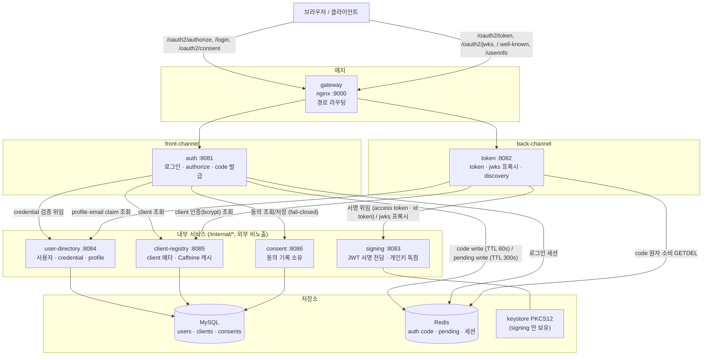
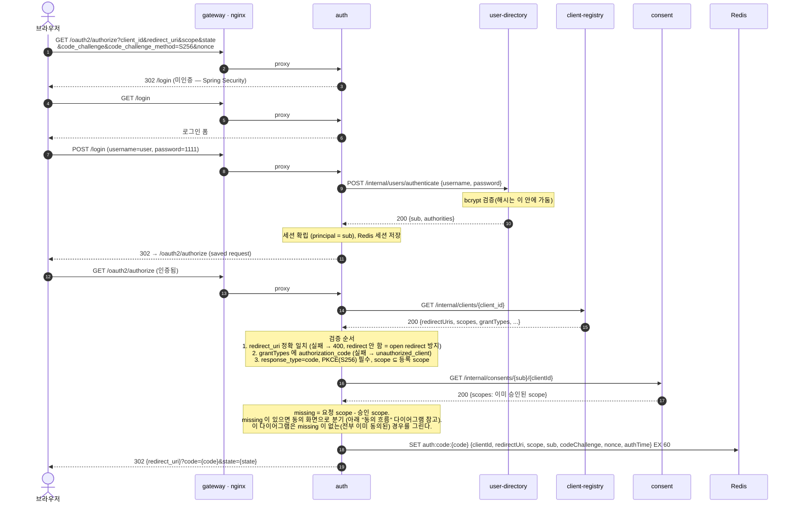
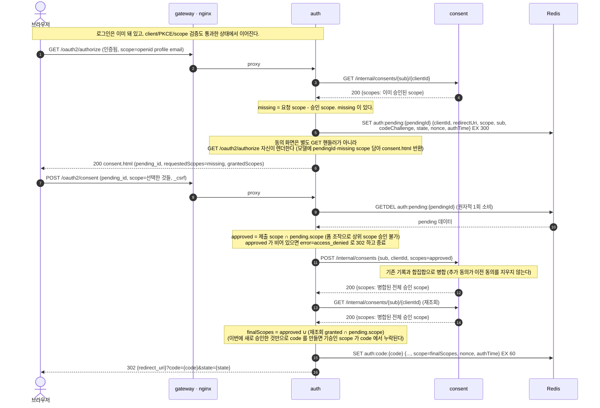
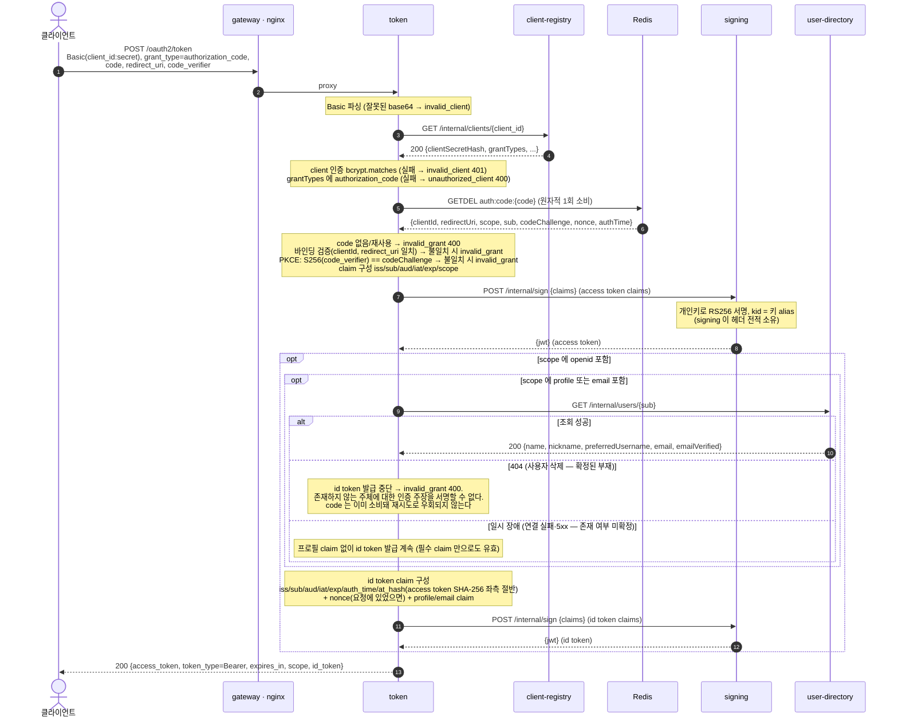
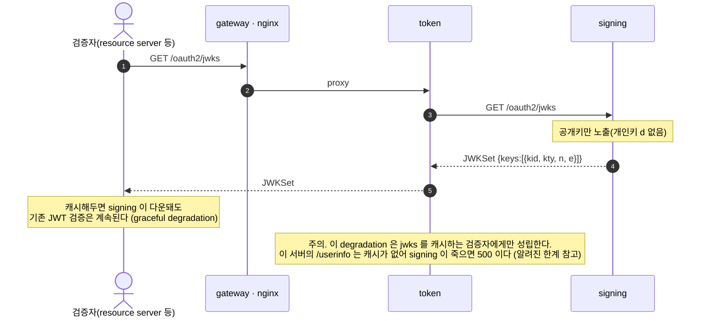
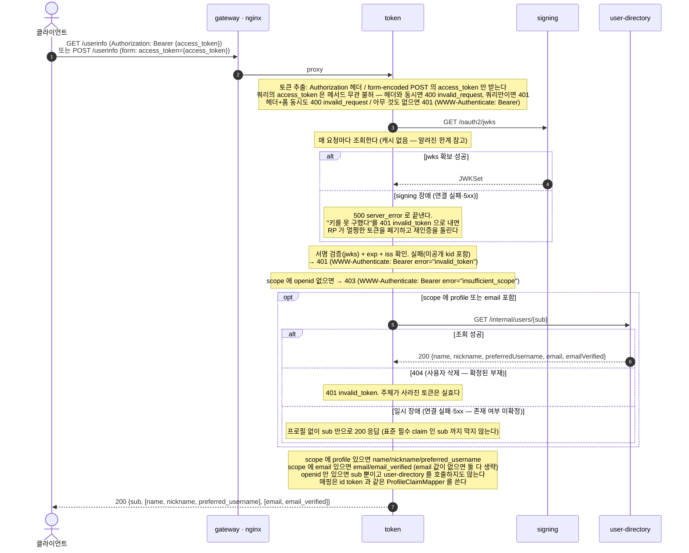

# microservice authorization server (슬라이스 1 + 슬라이스 2: OIDC)

- Spring Authorization Server starter **없이** OAuth/OIDC 로직을 직접 구현하고, 하나의 인가 서버를 **7개 독립 마이크로서비스**로 쪼갠 학습 프로젝트다.
- 슬라이스 1 의 목표: **authorization code + PKCE(S256) flow 하나**를 6개 서비스로 관통시키는 것. (완료)
- 슬라이스 2 의 목표: 그 위에 **OIDC(id token 발급 · userinfo · consent 화면/기록 분리)** 를 얹는 것. consent 를 7번째 서비스로 신설하고, token 이 openid scope 요청 시 id token 을 함께 발급하며 `/userinfo` 를 제공한다. (완료, refresh/introspection/admin 등록 API/내부 서비스 간 인증/Kafka 는 여전히 이후 과제)
- "빅테크는 인가 서버를 내부적으로 여러 서비스로 분해한다"(토큰 발급/로그인 UX/디렉토리/키 관리/동의 기록 분리, KMS 키 격리)를 축소판으로 재현한다.

## 구도

```
브라우저/클라이언트
   │
   ▼
 gateway (nginx, :9000)  ── 경로로 라우팅, /internal/* 은 외부 비노출
   ├─ /oauth2/authorize, /login, /oauth2/consent ─▶ auth (:8081)   front-channel
   └─ /oauth2/token, /oauth2/jwks, /.well-known, /userinfo ─▶ token (:8082)  back-channel
                                                 │
   auth ─▶ user-directory (:8084)  로그인 credential 검증 위임
   auth ─▶ client-registry (:8085) client 메타 조회 (+Caffeine 캐시)
   auth ─▶ consent (:8086)         동의 기록 조회/저장 (fail-closed)
   auth ─▶ Redis                   authorization code 저장 (auth:code:{code}, TTL 60s)
                                    + 동의 화면 대기 중 pending (auth:pending:{id}, TTL 300s)
   auth ─▶ Redis                   로그인 세션
                                                 │
   token ─▶ Redis                  code 원자적 1회 소비 (GETDEL)
   token ─▶ client-registry        client 인증(bcrypt) 검증
   token ─▶ signing (:8083)        JWT 서명 위임 (access token + id token, 개인키는 signing 만 보유)
   token ─▶ user-directory         id token/userinfo 의 profile·email claim 조회
   token, signing ─▶ jwks          공개키 노출

 MySQL : user-directory(users), client-registry(clients), consent(consents)
 Redis : authorization code, pending authorization(동의 대기), 로그인 세션(Spring Session)
```

### 아키텍처 모듈 다이어그램



## 서비스별 책임과 소유 데이터

| 서비스 | 포트 | 책임 | 소유 데이터 |
|---|---|---|---|
| gateway | 9000 | nginx 경로 라우팅 (front/back-channel 분리, /internal/* 격리) | 없음 |
| auth | 8081 | front-channel: 로그인, `/oauth2/authorize`(동의 화면 렌더 포함), `/oauth2/consent`(제출), code 발급 | (Redis code, pending, 세션) |
| token | 8082 | back-channel: `/oauth2/token`(id token 포함), `/userinfo`, jwks 프록시, discovery | (Redis code 소비) |
| signing | 8083 | JWT 서명 전담 + jwks 공개. **개인키 독점** | keystore(PKCS12) |
| user-directory | 8084 | 사용자 조회 + credential 검증(bcrypt 를 이 안에 가둠) + profile claim | users (MySQL) |
| client-registry | 8085 | client 조회 API + Caffeine 캐시(30s) | clients (MySQL) |
| consent | 8086 | 동의 기록 조회/저장 API (내부 전용, 화면은 auth 가 렌더) | consents (MySQL) |

핵심 설계 원칙:
- **데이터 소유권 분리** — auth 는 사용자/client/동의 DB 를 직접 안 보고 user-directory/client-registry/consent 를 REST 로 호출한다.
- **키 격리** — signing 만 개인키를 가진다. token 이 털려도 개인키는 안 나간다. (KMS 축소판)
- **상태 외부화** — auth 가 만든 code 를 token 이 Redis 로 넘겨받는다. 동의 화면 왕복 중인 인가 요청(pending)도 화면에는 불투명 id 만 내보내고 실제 값은 Redis 에 둔다. (서비스 경계를 넘는 flow)
- **동의는 fail-closed** — consent 조회가 실패하면(다운 등) "승인 여부 모름"을 "승인함"으로 취급하지 않고 예외를 그대로 전파한다. 동의 없이 토큰이 발급되는 것을 막기 위함이다.

## 기동 방법

1. 인프라(gateway nginx + mysql + redis)
   ```bash
   cd docker-compose && docker compose -p microservice-as up -d
   ```
2. 6개 서비스 빌드 (java 21)
   ```bash
   for s in signing user-directory client-registry consent token auth; do (cd $s && ./gradlew bootJar --no-daemon -q); done
   ```
3. **의존성 순서로** 기동 (signing → user-directory → client-registry → consent → token → auth)
   ```bash
   java -jar signing/build/libs/*.jar          # 8083
   java -jar user-directory/build/libs/*.jar    # 8084
   java -jar client-registry/build/libs/*.jar   # 8085
   java -jar consent/build/libs/*.jar           # 8086
   java -jar token/build/libs/*.jar             # 8082
   java -jar auth/build/libs/*.jar              # 8081
   ```
   - seed: user / 1111 (user-directory, profile 포함: name `Star Rye`, email `starryeye@example.com` 등), client `my-client` / `secret` (client-registry, redirectUri `http://127.0.0.1:8080/callback`, scope `openid profile email`)
   - 모든 요청은 gateway(http://localhost:9000) 로 보낸다.
   - 주의. `ddl-auto: update` 라 컨테이너/DB 를 재사용하면 seed 는 "이미 행이 있으면 스킵"으로 동작해 **이전 seed 스키마의 값이 남을 수 있다**(예: client 의 `email` scope, user 의 profile 컬럼이 나중에 추가된 경우). seed 코드와 실제 DB 값이 다르면 `UPDATE` 로 맞추거나 볼륨을 새로 만든다.

## 관통 flow (http/ 참고)

1. `GET /oauth2/authorize?...&code_challenge=...&code_challenge_method=S256` → 미인증이면 로그인으로 redirect
2. `POST /login` (user/1111) → auth 가 user-directory 에 credential 검증 위임, 성공 시 세션 확립(principal = sub)
3. authorize 재요청 → auth 가 client/redirect_uri/PKCE/scope 검증 후, **consent 에 이미 승인된 scope 를 조회한다**. 미승인 scope 가 있으면 pending 을 Redis 에 저장하고 동의 화면(`consent.html`)을 그대로 렌더한다(별도 GET 핸들러가 아니다 — 동의 화면은 `GET /oauth2/authorize` 자신이 그린다).
4. `POST /oauth2/consent` (pending_id, 체크된 scope) → auth 가 pending 을 소비(1회성)하고, 제출값과 pending 의 교집합만 승인 처리 → consent 에 저장(합집합 병합) → code 발급(Redis 저장, nonce·authTime 포함) → redirect_uri 로 302. 승인 scope 가 하나도 없으면 `error=access_denied` 로 302.
5. 이미 승인된 scope 의 부분집합만 요청하면 3번에서 미승인 scope 가 없으므로 **동의 화면 없이 바로 code** 가 발급된다.
6. `POST /oauth2/token` (Basic my-client:secret, code, code_verifier) → token 이 client 인증 → code 원자 소비 → 바인딩/PKCE 검증 → claim 구성 → signing 에 access token 서명 위임 → **scope 에 `openid` 가 있으면** id token 도 함께 발급한다(nonce·auth_time·at_hash, profile/email scope 면 user-directory 조회 후 name/email 등 claim 추가) → `{access_token, id_token, ...}`
7. `GET` 또는 `POST /userinfo` (Bearer access token) → token 이 jwks 로 access token 자체 검증 후 scope 에 대응하는 claim 만 돌려준다 (`openid` 없으면 403). `profile`/`email` scope 가 없으면 user-directory 를 조회하지 않는다.
8. client 의 등록 grantTypes 를 authorize/token 양쪽에서 강제한다 — 등록된 grantTypes 에 `authorization_code` 가 없으면 authorize 는 `unauthorized_client` 로 redirect, token 은 `unauthorized_client`(400) 로 거부한다.

## API 별 시퀀스 다이어그램

### `GET /oauth2/authorize` + `POST /login` — front-channel (로그인 → code 발급)



### `GET /oauth2/authorize` (렌더) + `POST /oauth2/consent` (제출) — 동의 흐름



### `POST /oauth2/token` — back-channel (code → access token, openid scope 면 id token 도 함께)



### `GET /oauth2/jwks` — 공개키 노출 (프록시)



### `GET`/`POST /userinfo` — access token 으로 scope 에 대응하는 claim 조회

OIDC Core 5.3.1 이 GET·POST 를 모두 요구하므로(MUST) 둘 다 받는다. RFC 6750 §3.1 은 토큰 전달 방식으로
Authorization 헤더 / form-encoded body / URI 쿼리 셋을 정의하는데, 이 서버는 그 중 **헤더**와 **form-encoded
POST 의 `access_token` 파라미터**만 받는다. **URI 쿼리의 `access_token` 은 GET/POST 를 가리지 않고 받지 않는다**
(쿼리스트링은 프록시·서버 접근 로그와 Referer 헤더에 그대로 남는다) — 쿼리에 실려 있으면 헤더 유무와 무관하게
유효한 전달로 인정하지 않는다. 헤더+폼 또는 헤더+쿼리를 동시에 쓰면 400 `invalid_request`, 쿼리만 있으면(폼
여부 무관) 401, 아무 것도 없으면 401 이다.
주의. form-encoded POST 라도 `access_token` 이 쿼리스트링에도 실려 있으면 서블릿이 쿼리·폼 파라미터를 이름으로
병합하므로 `@RequestParam` 값만으로는 폼에서 온 값인지 쿼리에서 온 값인지 구분할 수 없다. `getQueryString()`
의 raw 쿼리를 직접 파싱해 쿼리에 `access_token` 이 있는지부터 판정해야 한다.



## 검증된 성공 기준 (e2e, 게이트웨이 경유)

### 슬라이스 1 (authorization code + PKCE)

1. 로그인 → code → token → JWT 발급 완주. access token: `iss=http://localhost:9000`, `sub=user-sub-0001`, `aud=my-client`, header `kid=signing-key-2026`, `alg=RS256`.
2. 발급 JWT 를 `/oauth2/jwks`(signing 공개키)로 RS256 서명 검증 통과. jwks 에 개인키(d) 없음.
3. **graceful degradation** — signing 을 내리면 신규 토큰 발급은 `server_error`(OAuth2 포맷)로 실패하지만, **이미 발급된 JWT 는 캐시된 공개키로 계속 검증**된다. (키 격리 + JWT 자가검증의 운영 가치)
   - 주의. 이것은 공개키를 미리 받아둔 **외부 검증자** 기준이다. 이 서버의 `/userinfo` 는 jwks 캐시가 없어 signing 장애 시 500 `server_error` 다 — e2e 로 확인된 내용은 아래 슬라이스 2 항목 16 참고(알려진 한계이기도 하다).
4. code 재사용 → `invalid_grant` (Redis GETDEL 원자 소비).
5. PKCE verifier 변조 → `invalid_grant`.
6. 보안 경계: 미등록 redirect_uri / unknown client → **400, redirect 하지 않음(open redirect 방지)**. PKCE 누락 → `invalid_request`. 틀린 client secret → `invalid_client`(401).

### 슬라이스 2 (OIDC: id token · userinfo · consent)

7. **동의 화면 노출** — 미승인 scope(`openid profile email`) 로 authorize 하면 `GET /oauth2/authorize` 가 `consent.html`(pending_id 히든 필드 포함)을 그대로 렌더한다. 제출(`POST /oauth2/consent`)하면 code 가 발급된다.
8. **id token** — 발급된 id token 에 `iss=http://localhost:9000`, `sub=user-sub-0001`, `aud=my-client`, 요청한 `nonce` 그대로 반영, `at_hash`(access token SHA-256 좌측 절반의 BASE64URL)가 실측 재계산값과 일치. jwks 공개키로 RS256 서명 검증 PASS(수동 modpow 재계산으로 확인).
9. **재인가 시 동의 생략** — 이미 전부 승인된 scope 의 부분집합(또는 동일 집합)으로 재요청하면 동의 화면 없이 바로 `302 Location: ...?code=...`.
10. **userinfo scope 필터링** — `openid profile email` 토큰은 `sub/name/nickname/preferred_username/email/email_verified` 전부 응답. `openid` 만 있는 토큰은 `sub` 만 응답(profile/email claim 없음).
11. **동의 거부** — 동의 화면에서 scope 를 하나도 체크하지 않고 제출하면 redirect 에 `error=access_denied`.
12. **무효 토큰** — `userinfo` 에 형식이 깨진 토큰(`not.a.token`)을 보내면 `401` + `WWW-Authenticate: Bearer error="invalid_token"` (RFC 6750).
13. **회귀(code 재사용)** — 슬라이스 2 변경 이후에도 authorization code 재사용은 여전히 `invalid_grant`.
14. **`POST /userinfo` (OIDC Core 5.3.1 MUST) + RFC 6750 §3.1 토큰 전달 방식** — (a) `GET` + Authorization 헤더 → `200`. (b) `POST` + Authorization 헤더 → `200`(이전에는 `405`). (c) `POST` + form-encoded body 의 `access_token` → `200` + 전체 claim. (d) 헤더+폼 동시 → `400 invalid_request`. (e) URI 쿼리의 `access_token` — 쿼리만 있으면(단독이든 form-encoded POST 와 병행이든) `401`, 쿼리+헤더 동시면 `400 invalid_request`. 쿼리는 GET/POST 를 가리지 않고 유효한 전달로 인정하지 않는다.
    - 파라미터 이름 경계 판정(`my_access_token=` 을 `access_token` 으로 오탐하지 않는다)은 단위 테스트로 고정한다.
15. **user-directory 사용자 부재 → 401** — `users` 테이블에서 발급받은 access token 의 sub 에 해당하는 행을 삭제한 뒤 같은 토큰으로 `/userinfo` 를 호출하면 `401` + `WWW-Authenticate: Bearer error="invalid_token"` (404 는 "확정된 부재"이므로 degrade 가 아니라 실효 처리). 확인 후 행을 원복.
16. **signing 장애 시 `/userinfo` → 500 `server_error`** — signing 프로세스를 내린 채 `/userinfo` 를 호출하면 `401` 이 아니라 `500` + `{"error":"server_error"}`. "키를 못 구했다"를 401 로 내면 RP 가 멀쩡한 토큰을 폐기하고 재인증을 돌리므로 신중히 구분해야 한다는 설계 의도가 실제로 지켜짐을 확인. signing 재기동 후 `/userinfo` 가 다시 `200` 으로 복귀하는 것도 함께 확인.

## 슬라이스 2에서도 제외 (이후 sub-project)

refresh token, introspection, back-channel logout(sid), admin 등록 API(현재 seed), **내부 서비스 간 인증**(현재 신뢰 네트워크 가정), Kafka 인증 이벤트 스트림, 관측성/서킷브레이커.

## 알려진 한계 / 추후 개선

- **프록시 헤더(ForwardedHeaderFilter) 미적용** — auth 의 로그인 redirect Location 이 게이트웨이 포트(:9000)를 잃고 `http://localhost/...` 로 나온다. curl e2e 는 절대 URL 로 우회해 통과하지만, 실제 브라우저 flow 는 auth 에 ForwardedHeaderFilter 를 추가해 X-Forwarded-Host(포트 포함)를 반영해야 한다. (production-ready-authorization-server 의 방식 참고)
- **내부 REST 호출 무인증** — /internal/* 은 gateway 라우팅에서만 제외될 뿐 네트워크로 접근 가능하면 무방비다. 서비스 간 인증(API 키/mTLS)이 추후 개선 1순위.
- **jwks 캐시 부재는 성능이 아니라 가용성 한계다** — `AccessTokenVerifier` 가 access token 검증마다 signing 의 `/oauth2/jwks` 를 호출한다(캐시 없음). 부하가 signing 에 집중되는 것도 문제지만, 더 큰 문제는 **signing 이 죽으면 `/userinfo` 가 통째로 500 `server_error` 가 된다**는 점이다. 슬라이스 1 의 graceful degradation("이미 발급된 JWT 는 캐시된 공개키로 계속 검증된다")은 jwks 를 캐시하는 외부 검증자에게만 성립하고 이 서버의 `/userinfo` 에는 성립하지 않는다. jwks 를 kid 기준으로 캐시(TTL)하면 성능과 가용성이 함께 해결된다. 다음 개선.
  - 주의. 이때 500 대신 401 `invalid_token` 을 주면 안 된다. RP 는 그것을 "토큰이 죽었다"로 읽고 멀쩡한 토큰을 폐기한 뒤 재인증을 돌리므로, signing 장애 한 번이 전 RP 의 동시 재인증 폭풍으로 증폭된다. 그래서 `AccessTokenVerifier` 는 "키 확보 실패"와 "토큰 무효"를 다른 예외로 갈라 던진다.
- **`auth_time` 이 로그인 시각이 아니다** — id token 의 `auth_time` 은 `AuthorizeController` 가 authorize 요청을 처리한 시각(`Instant.now()`)이며, 실제 `POST /login` 이 성공한 시각이 아니다. 세션에 로그인 시각을 저장해두지 않기 때문. 표준의 `auth_time` 은 최종 인증 시각이므로 RP 가 `max_age` 로 재인증을 강제할 때 이 값으로는 판단할 수 없다. SSO 재사용 시나리오(로그인은 예전에 했고 이번엔 세션만 재사용)에서 `auth_time` 이 매 authorize 마다 갱신되는 것으로 보인다.
- **access token 의 `scope` claim 이 JSON 배열이다** — RFC 9068 2.2.3 은 `scope` 를 공백 구분 **문자열**로 규정하지만 이 구현은 `["openid","profile"]` 배열로 낸다(슬라이스 1 부터의 선택). `AccessTokenVerifier` 가 같은 형식을 읽으므로 내부적으로는 일관되지만, RFC 9068 을 기대하는 외부 resource server 는 scope 를 파싱하지 못한다.
- **access token 과 id token 을 구분할 수 있는 표식이 없다** — 둘 다 signing 의 같은 키로 서명되고 `iss`·`sub` 도 같으며 `typ` 헤더 구분이 없다. 지금은 id token 에 `scope` claim 이 없어 `/userinfo` 에 id token 을 들이밀면 `openid` scope 가 없다고 403 이 나므로 토큰 타입 혼동이 성립하지 않는다. 다만 그 방어는 우연에 가깝다 — **id token 에 `scope` 를 싣는 순간 혼동이 성립한다.** 정석은 RFC 9068 의 `typ: at+jwt` 헤더로 access token 을 명시하고 검증 시 그 값을 강제하는 것이다. signing 의 서명 API 계약(헤더를 signing 이 전적으로 소유한다)을 바꿔야 하므로 이번 슬라이스에서는 구현하지 않는다. 다음 슬라이스 대상.
- HA(다중 인스턴스), 키 로테이션, purge 등은 production-ready-authorization-server 에서 다룬 주제.

## 설계/계획 문서

- 슬라이스 1 설계: [docs/superpowers/specs/2026-07-18-microservice-authorization-server-slice1-design.md](../../../../docs/superpowers/specs/2026-07-18-microservice-authorization-server-slice1-design.md)
- 슬라이스 1 구현 계획: [docs/superpowers/plans/2026-07-18-microservice-authorization-server-slice1.md](../../../../docs/superpowers/plans/2026-07-18-microservice-authorization-server-slice1.md)
- 슬라이스 2(OIDC) 설계: [docs/superpowers/specs/2026-07-25-microservice-oidc-slice2-design.md](../../../../docs/superpowers/specs/2026-07-25-microservice-oidc-slice2-design.md)
- 슬라이스 2(OIDC) 구현 계획: [docs/superpowers/plans/2026-07-25-microservice-oidc-slice2.md](../../../../docs/superpowers/plans/2026-07-25-microservice-oidc-slice2.md)
