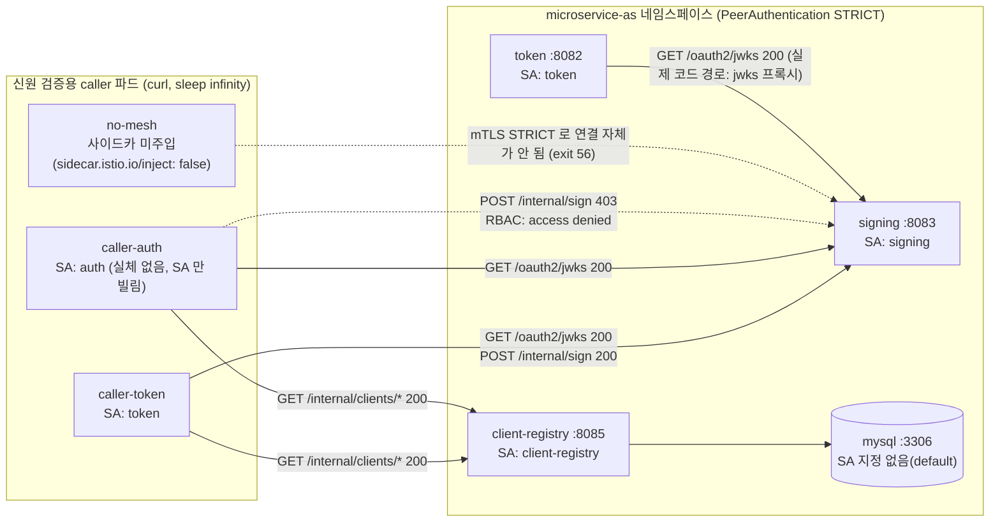

# microservice — Istio mTLS 트랙 (k8s)

이 디렉터리는 `oauth-2/authorization-server/practice/microservice/` 의 **Istio mTLS 트랙**을 위한
Kubernetes/Istio 리소스를 담는다.

**이 트랙은 기존 `java -jar` 트랙과 별개다.** `docker-compose/`, `gateway/`, `http/`, 각 서비스의
`*/src` 는 이 트랙의 대상이 아니고 그대로 유지된다. 기존 e2e(스크립트로 각 서비스를 `java -jar` 로
띄우는 방식)를 대체하지 않으며, 두 트랙은 서로 독립적으로 존재한다. 이 트랙은 내부 서비스 간
인증·인가(mTLS, `AuthorizationPolicy`)를 **Spring 코드 변경 없이** Istio 서비스 메시가 대신 처리하는
것을 검증하기 위한 것이다.

## 사전 준비물

- `kubectl`
- `docker` (Docker Desktop)
- `kind` — 로컬 전용 k8s 클러스터를 만드는 도구
- `istioctl` — Istio 설치/조작 CLI

`kind` 와 `istioctl` 은 Homebrew 로 설치한다.

```bash
brew install kind istioctl
```

**주의.** Docker Desktop 자체의 Kubernetes(현재 `docker-desktop` 컨텍스트)는 이 트랙과 무관하며
건드리지 않는다. Docker Desktop 의 k8s 는 노드 containerd 스토어가 docker 데몬 이미지 스토어와
분리돼 있어, 로컬에서 빌드한 이미지를 그 클러스터에 올리면 `ErrImageNeverPull` 로 막힌다. `kind` 로
별도 클러스터를 만들면 `kind load docker-image` 한 줄로 로컬 이미지를 노드에 넣을 수 있어 이 문제가
없다.

## 설치·기동 절차

> **어디까지 실제로 돌려본 절차인가.** Step 1~5 와 아래 `verify.sh` 의 검사 [0]·[2]~[8b] 는
> 클러스터가 떠 있던 시점에 실제로 실행해 확인했다(그 raw 출력이 아래에 있다). 반면
> **Step 6~10 의 명령과 `verify.sh` 의 `[1]`·`[9]` 검사는 클러스터를 지운 뒤에 정리·보강한
> 것이라 통짜로 실행해 본 적이 없다.** 정적 검증만 통과했다 — `bash -n`,
> `kubectl apply --dry-run=client`, 매니페스트·jar 이름 대조, 그리고 `[9]` 는 Spring 소스를
> 한 줄 변이시켜 검사가 실제로 FAIL 을 내는지 확인했다. 다음에 클러스터를 다시 세우면
> Step 6~10 을 한 번 통짜로 돌려 확인할 것.

### Step 1: 도구 확인

```bash
command -v kind istioctl kubectl docker
```

넷 다 있어야 다음 단계로 진행한다. `kind` 또는 `istioctl` 이 없으면 위 `brew install` 로 설치한다.
설치가 권한 문제로 막히면 여기서 멈추고 사용자에게 보고한다 — 다른 설치 경로(수동 바이너리 다운로드
등)로 우회하지 않는다.

### Step 2: Istio 가 지원하는 k8s 버전 확인

```bash
istioctl version --remote=false
```

설치된 Istio 버전에 대해 [Istio Supported Releases](https://istio.io/latest/docs/releases/supported-releases/)
에서 공식 지원 k8s 범위를 확인하고, 그 범위 안에서 `kindest/node` 이미지 태그를 고른다. **Docker
Desktop 의 k8s 버전을 그대로 따라가지 않는다** — 최신이라는 이유만으로는 Istio 의 지원 범위 안에
있다는 보장이 없다. 실제로 채택한 값과 그 근거는 아래 "이번에 고른 버전과 근거" 참고 —
다음 Step 의 `<NODE_IMAGE>` 자리에 그 값을 넣는다.

### Step 3: kind 클러스터 생성

```bash
kind create cluster --name microservice-as --image kindest/node:<NODE_IMAGE>
kubectl config use-context kind-microservice-as
kubectl get nodes
```

Expected: `microservice-as-control-plane` 이 `Ready`.

**주의.** 기존 `docker-desktop` 컨텍스트는 건드리지 않는다. 이 트랙의 모든 `kubectl` 명령은
`kind-microservice-as` 컨텍스트에서 실행한다. `kind create cluster` 는 클러스터 생성 직후
kubeconfig 의 현재 컨텍스트를 자동으로 `kind-microservice-as` 로 바꾼다 — 이 변경은
`~/.kube/config` 에 남고, 이후 별도 셸/세션에서도 이어진다.

### Step 4: Istio 설치 (minimal 프로파일)

```bash
istioctl install --set profile=minimal -y
kubectl get pods -n istio-system
```

Expected: `istiod-*` 파드가 `Running 1/1`.

`minimal` 프로파일은 컨트롤 플레인(istiod)만 설치한다. 이 트랙은 클러스터 외부에서 들어오는
트래픽을 다루지 않으므로 ingress gateway 가 필요 없다.

### Step 5: 네임스페이스 생성 (사이드카 자동 주입 라벨 포함)

`k8s/base/namespace.yaml`:

```yaml
apiVersion: v1
kind: Namespace
metadata:
  name: microservice-as
  labels:
    istio-injection: enabled
```

```bash
kubectl apply -f oauth-2/authorization-server/practice/microservice/k8s/base/namespace.yaml
kubectl get ns microservice-as --show-labels
```

Expected: 라벨 목록에 `istio-injection=enabled` 가 보인다.

**주의.** 이 라벨이 없으면 이 네임스페이스에 뜬 파드에 Istio 사이드카(`istio-proxy`)가 주입되지
않는다. 사이드카가 없으면 mTLS 도 `AuthorizationPolicy` 도 전부 무력화된다 — mesh 가 트래픽을 보지
못하기 때문이다. 파드가 (`2/2` 가 아니라) `READY 1/1` 로 뜨면 이 라벨이 빠졌는지부터 의심한다.

### Step 6: jar 빌드

각 서비스 디렉터리에서 실행한다.

```bash
cd oauth-2/authorization-server/practice/microservice
for s in signing client-registry token; do
  (cd $s && ./gradlew bootJar --no-daemon -x test)
done
ls */build/libs/*-SNAPSHOT.jar
```

Expected: `signing-0.0.1-SNAPSHOT.jar` · `client-registry-0.0.1-SNAPSHOT.jar` ·
`token-0.0.1-SNAPSHOT.jar` 세 jar 이 보인다.

**주의.** `./gradlew` 가 exit 137(SIGKILL)로 죽으면 메모리 부족이 원인이다. 우회 경로:
`java -cp gradle/wrapper/gradle-wrapper.jar org.gradle.wrapper.GradleWrapperMain bootJar --no-daemon -x test`.

### Step 7: 이미지 빌드와 kind 노드 적재

빌드 컨텍스트가 microservice 루트여야 `--build-arg JAR=...` 의 상대 경로가 맞는다.

```bash
cd oauth-2/authorization-server/practice/microservice
for s in signing client-registry token; do
  docker build -f k8s/Dockerfile \
    --build-arg JAR="$s/build/libs/${s}-0.0.1-SNAPSHOT.jar" \
    -t "${s}:local" .
done
docker images | grep -E '^(signing|client-registry|token) '

docker pull curlimages/curl:latest
for img in signing:local client-registry:local token:local curlimages/curl:latest; do
  kind load docker-image "$img" --name microservice-as
done
docker exec microservice-as-control-plane crictl images | grep -E 'signing|client-registry|token|curl'
```

Expected: 세 로컬 이미지가 `docker images` 에 보이고, 네 이미지(로컬 셋 + `curlimages/curl`)가
전부 kind 노드의 containerd 스토어에 있다.

**주의.** zsh 에서 `$변수:접미사` 형태는 `:` 뒤 글자를 파라미터 모디파이어로 해석한다.
예를 들어 `$s:local` 은 `:l`(소문자 변환) 모디파이어로 읽히고 남은 `ocal` 이 그대로 뒤에
붙어 엉뚱한 문자열(`$s=signing` 이면 `signingocal`)이 나온다 — 실측된 동작이다. 이미지
태그처럼 변수 뒤에 `:` 가 오는 문자열을 조립할 때는 `${s}:local` 로 변수를 중괄호로 감싸
모디파이어 해석 자체를 막아야 한다. `for img in signing:local ...` 처럼 루프 변수 자체가
이미 완성된 리터럴 문자열(변수 확장이 아님)인 경우는 이 문제가 없다 — 문제는 오직
`$변수` 바로 뒤에 `:` 가 붙어 **그 자리에서 확장**될 때다.

### Step 8: MySQL · client-registry · signing · token 배포

```bash
cd oauth-2/authorization-server/practice/microservice
kubectl apply -f k8s/base/mysql.yaml
kubectl wait --for=condition=available --timeout=180s deploy/mysql -n microservice-as
kubectl apply -f k8s/base/client-registry.yaml
kubectl wait --for=condition=available --timeout=180s deploy/client-registry -n microservice-as
kubectl apply -f k8s/base/signing.yaml -f k8s/base/token.yaml
kubectl wait --for=condition=available --timeout=180s deploy/signing deploy/token -n microservice-as
kubectl get pods -n microservice-as
```

Expected: `mysql`·`client-registry`·`signing`·`token` 네 파드 전부 `READY 2/2`.

**주의.** client-registry 가 기동 중 죽거나 재시작을 반복하면 MySQL 연결 실패다. 아래
"진단표" 참고.

### Step 9: 호출자 파드와 mTLS 강제(STRICT)

```bash
cd oauth-2/authorization-server/practice/microservice
kubectl apply -f k8s/base/callers.yaml
kubectl wait --for=condition=ready --timeout=120s pod/caller-token pod/caller-auth pod/no-mesh -n microservice-as
kubectl apply -f k8s/istio/peer-authentication.yaml
sleep 10
```

Expected: `caller-token`·`caller-auth` 는 `READY 2/2`, `no-mesh` 는 `READY 1/1`(사이드카를
일부러 안 넣은 파드라 컨테이너가 하나뿐이다).

### Step 10: `AuthorizationPolicy` 적용

```bash
cd oauth-2/authorization-server/practice/microservice
kubectl apply -f k8s/istio/authz-signing.yaml -f k8s/istio/authz-client-registry.yaml
sleep 10
```

여기까지 마치면 클러스터가 `verify.sh` 를 돌릴 수 있는 상태다(아래 "`verify.sh` 사용법"
참고).

## 이번에 고른 버전과 근거

| 항목 | 값 |
|---|---|
| Homebrew `kind` | 0.32.0 |
| Homebrew `istioctl` / Istio | 1.30.3 |
| kind 노드 이미지 | `kindest/node:v1.34.8@sha256:02722c2dedddcfc00febf5d27fbeb9b7b2c14294c82109ff4a85d89ac9ba3256` |

**근거.**

- `istioctl version --remote=false` 로 확인한 Istio 버전은 `1.30.3` 이고, Istio 공식 지원 릴리즈
  표(1.30 행)에 따르면 이 버전이 공식 지원하는 k8s 버전은 **1.32, 1.33, 1.34, 1.35, 1.36** 이다
  (1.27~1.31 은 "tested, but not supported"). Docker Desktop 의 k8s(v1.34.3)를 그대로 쓰지 않고
  독립적으로 이 표를 확인했다.
- kind `v0.32.0` 릴리즈가 사전 빌드해 제공하는 노드 이미지는 `v1.36.1`, `v1.35.5`, `v1.34.8`,
  `v1.33.12` 네 가지이며, 넷 다 Istio 1.30.3 의 공식 지원 범위(1.32~1.36) 안에 든다.
- 이 중 `v1.34.8` 을 선택했다. `v1.36.1` (kind 0.32.0 의 기본값)은 kubeadm 설정 포맷이
  v1beta3 에서 v1beta4 로 바뀌는 첫 릴리즈(k8s 1.36.0+)라서, 처음 부트스트랩하는 클러스터에서
  불필요한 리스크를 지고 싶지 않았다. `v1.34.8` 은 기존 v1beta3 포맷을 그대로 쓰는 마지막 라인 중
  하나이면서 Istio 1.30.3 지원 범위의 중간에 위치해 안정적이다.
- 반드시 `@sha256` 다이제스트까지 함께 지정한다 — kind 릴리즈 노트가 재현성을 위해 태그만이 아니라
  다이제스트 고정을 명시적으로 권장한다.

**주의.** 다이제스트까지 고정하는 것은 **kind 노드 이미지뿐**이다(`base/callers.yaml` 의
`curlimages/curl:latest`, `base/mysql.yaml` 의 `mysql:8` 은 태그만 쓴다). 노드 이미지는
클러스터의 k8s API 버전을 그대로 결정하고 그 버전이 Istio 호환 범위 안에 있는지가 이
트랙의 핵심 전제라, 버전이 조용히 바뀌면(같은 태그가 다른 다이제스트를 가리키게 되는 경우
포함) Istio 설치 자체가 깨질 수 있다. 반면 `curl`·`mysql` 은 이 학습 트랙에서 호출하는
API 표면(`curl`, MySQL 프로토콜)이 좁고 안정적이라 버전이 조금 달라져도 검증 시나리오에
영향을 주지 않는다 — 그래서 이 둘은 다이제스트로 고정하지 않는다.

## 아키텍처 — 누가 어떤 SA 를 갖고 무엇을 부를 수 있는가



**주의.** `caller-auth` 는 실제 `auth` 서비스가 아니다 — `auth` 서비스 자체는 이 트랙에 배포하지
않는다(Redis·user-directory·consent·session 이 더 필요하다). `ServiceAccount: auth` 만 빌린 curl
파드로, Istio 신원(SPIFFE `cluster.local/ns/microservice-as/sa/auth`)은 파드가 무엇을 실행하느냐가
아니라 어떤 SA 로 뜨느냐에서 나온다는 것을 보이기 위한 것이다.

## 인가 표

| 호출자 (SA) | 대상 | 기대 | 근거 |
|---|---|---|---|
| `token` | `signing GET /oauth2/jwks` | 200 | `AuthorizationPolicy/signing` 두 번째 rule: `token`·`auth` 모두 허용 |
| `token` | `signing POST /internal/sign` | 200 | 같은 정책 첫 번째 rule: `token` 만 허용 |
| `auth` | `signing GET /oauth2/jwks` | 200 | 두 번째 rule에 `auth` 포함 |
| `auth` | `signing POST /internal/sign` | **403** `RBAC: access denied` | 첫 번째 rule에 `auth` 없음 — 개인키 보유자(signing)에게 브라우저를 마주보는 신원이 무제한 접근권을 갖지 않도록 서명 엔드포인트만 `token` 으로 좁혔다 |
| `token`, `auth` | `client-registry GET /internal/clients/*` | 200 | `AuthorizationPolicy/client-registry` 가 둘 다 허용 |
| (사이드카 없음) | `signing` 아무 경로 | **연결 자체 실패** (`000`, curl exit 56) | `PeerAuthentication` STRICT — mTLS 자체가 성립하지 않아 `AuthorizationPolicy` 판정 이전에 막힌다 |
| `token` (실제 배포 코드) | `signing GET /oauth2/jwks` (`token:8082/oauth2/jwks` 프록시) | 200 | `token` 서비스가 실제로 구현한 jwks 프록시 경로 — caller 파드가 아니라 배포된 `token` 파드 자신이 호출자다 |

**주의.** 위 표는 이 트랙에 배포된 `caller-token`/`caller-auth`/`token` 기준이다. **실제 소스 코드의 호출자 집합은 이보다 넓다** — `signing POST /internal/sign` 은 `token` 과 `session` 이 부르고(`session/src/main/java/dev/starryeye/session/client/SigningClient.java`, `LogoutTokenDelivery.java` — 슬라이스 5 의 back-channel logout 경로), `client-registry GET /internal/clients/*` 는 `token`·`auth`·`session` 셋이 부른다. `session` 서비스 자체를 이 트랙에 배포하지 않았으므로(범위 밖) `AuthorizationPolicy/signing`·`AuthorizationPolicy/client-registry` 의 `principals` 에는 `sa/session` 이 없다 — 이것은 "session 이 안 부른다"는 사실 진술이 아니라 "이 트랙에 없다"는 범위 표시다. **이 트랙을 확장해 `session` 을 배포한다면 두 정책의 관련 `principals` 에 `cluster.local/ns/microservice-as/sa/session` 을 반드시 추가해야 한다** — 추가하지 않으면 실제 배포 코드(back-channel logout)가 403 으로 조용히 깨진다.

## `verify.sh` 사용법

클러스터가 떠 있고 `base/`·`istio/` 매니페스트가 전부 `apply` 된 상태에서 실행한다.

```bash
cd oauth-2/authorization-server/practice/microservice/k8s
./verify.sh
```

`[0]` 은 검사 전에 핵심 거부(`caller-auth` → `signing /internal/sign`)가 403 으로 수렴할 때까지
최대 60초 기다린다(아래 "xDS 전파 지연" 참고). 설계 문서(§5 검증)의 10개 기준(1~8, 8b, 9)을
전부 돌린 뒤 `PASS=<n> FAIL=<n>` 을 마지막 줄에 낸다. 종료 코드는 `FAIL=0` 이면 0, 아니면
1(`[ "$FAIL" -eq 0 ]`).

### 실행 결과 (raw 출력)

```
[0] 정책 전파 대기 (최대 60초)
  전파 완료: 1회차 (약 2초)
[1] 파드 상태
NAME                               READY   STATUS    RESTARTS   AGE
caller-auth                        2/2     Running   0          157m
caller-token                       2/2     Running   0          157m
client-registry-5847f68867-9tvvr   2/2     Running   0          171m
mysql-7d858c949d-szmgf             2/2     Running   0          172m
no-mesh                            1/1     Running   0          157m
signing-59f5c7b7b8-c9bb9           2/2     Running   0          164m
token-7bdb849678-skgfm             2/2     Running   0          164m
caller-auth true
caller-token true
client-registry-5847f68867-9tvvr true
mysql-7d858c949d-szmgf true
no-mesh true
signing-59f5c7b7b8-c9bb9 true
token-7bdb849678-skgfm true
[2] caller-token -> signing /oauth2/jwks
  PASS  token 신원은 jwks 를 읽는다  (200)
[3] caller-token -> signing /internal/sign
  PASS  token 신원은 서명할 수 있다  (200)
[4] caller-auth -> signing /oauth2/jwks
  PASS  auth 신원은 jwks 를 읽는다  (200)
[5] caller-auth -> signing /internal/sign  <= 핵심
  PASS  auth 신원은 서명할 수 없다  (403)
  본문: RBAC: access denied
  PASS  거부가 Istio 에서 왔다  (RBAC: access denied)
[6] caller-token -> client-registry
  PASS  token 신원은 client 를 읽는다  (200)
[7] caller-auth -> client-registry
  PASS  auth 신원도 client 를 읽는다  (200)
[8] no-mesh -> signing (mTLS 강제)
command terminated with exit code 56
  PASS  사이드카 없는 파드는 닿지 못한다  (000)
[9] 실제 코드 경로: token -> signing 프록시
  PASS  token 의 jwks 프록시가 동작한다  (200)

PASS=9 FAIL=0
```

**주의.** 위 raw 출력은 이전 버전 `verify.sh`(클러스터가 떠 있던 시점)의 캡처다. 현재
스크립트 본문(아래)은 `[1]` 이 `check()` 로 PASS/FAIL 을 직접 판정하고, 설계 §5 의 9번
기준("git diff — Spring 소스 변경 0줄")을 별도 검사로 갖고 있어 위 출력과 형태가 다르다.
클러스터가 삭제된 상태라 현재 스크립트로 새 raw 출력을 다시 캡처할 수는 없다 — 위 출력을
"현재 스크립트의 실행 결과"로 읽지 않는다.

위 raw 출력의 `[1]` 두 번째 블록(파드 이름 + `true`)이 바로 그 옛 버전이 남긴 함정이다.
`2/2` 인 파드들이 전부 `true` **하나만** 찍었다 — 옛 스크립트가 읽던 `containerStatuses[*].ready`
에는 `istio-proxy` 가 아예 들어 있지 않기 때문이다(아래 native sidecar 절 참고). 즉 그 출력은
애플리케이션 컨테이너만 본 것이고, 사이드카가 주입되지 않은 `1/1` 파드도 똑같이 `true` 를 찍는다.

현재 스크립트의 `[1]` 은 그래서 두 가지를 따로 본다.

- **파드 `Ready` 조건** — k8s 1.28+ 는 `restartPolicy: Always` 인 init 컨테이너(= native
  sidecar)까지 이 조건에 집계하므로, 사이드카가 안 뜬 파드는 여기서 걸린다.
- **`initContainers` 에 `istio-proxy` 가 있는가** — 주입 자체가 안 된 `1/1` 파드는 `Ready` 가
  `True` 라 위 조건만으로는 통과해 버린다. 진단표 첫 행("사이드카 미주입")을 잡으려면 이 확인이 필요하다.

`no-mesh` 는 애초에 주입 대상이 아니므로 이 판정 대상(세 서비스)에서 빠져 있다 — `1/1` 이 정상이다.

## native sidecar — Istio 1.30.3

Istio 1.30.3 은 kubernetes native sidecar 를 쓴다. `istio-proxy` 컨테이너가
`spec.containers` 가 아니라 **`spec.initContainers`** 에 `restartPolicy: Always` 를 달고
들어간다(k8s 1.28+ 의 native sidecar 기능). 실제 확인:

```bash
kubectl get pod -n microservice-as <파드> -o jsonpath='{.spec.initContainers[*].name}'
# istio-init istio-proxy
kubectl get pod -n microservice-as <파드> -o jsonpath='{.spec.containers[*].name}'
# signing        (istio-proxy 가 안 보인다 — containers 만 보면 사이드카가 없는 것처럼 보인다)
```

**주의.** 사이드카 주입 여부를 `kubectl get pod -o jsonpath='{.spec.containers[*].name}'` 로만
확인하면 안 된다 — `istio-proxy` 는 `initContainers` 에 있다. 다만 `kubectl get pods` 의 `READY`
집계(`containerStatuses` 전체)에는 `restartPolicy: Always` 인 init 컨테이너도 포함되므로, 정상
주입 시 애플리케이션 파드는 여전히 `2/2` 로 보인다 — `READY` 열만 보면 사이드카가 어느 스펙 필드에
있는지는 몰라도 "떠 있다"는 사실은 정확히 알 수 있다.

## xDS 전파 지연

`AuthorizationPolicy`/`PeerAuthentication` 을 `kubectl apply` 한 직후에는 istiod 가 그 변경을
각 사이드카(Envoy)에 xDS 로 전파하는 데 시간이 걸린다. 이 kind 클러스터에서는 그 창이 실측
10초를 넘긴 적이 있다. 그 창 안에서 검사하면 정책 자체는 멀쩡한데도 **거부돼야 할 호출이 잠깐
200 을 내** FAIL 이 난다.

`verify.sh` 의 `[0]` 단계가 이 문제를 다룬다 — 실제 검사를 시작하기 전에 핵심 거부 케이스
(`caller-auth` → `signing /internal/sign`)가 403 으로 수렴할 때까지 최대 60초(2초 간격 30회)
기다린다. 제한 시간 안에 수렴하면 그 즉시 검사로 넘어가고, 수렴하지 않으면 경고를 남기고
그대로 검사에 들어간다 — **전파 지연과 실제 정책 결함을 구분하되, 결함을 대기로 덮어 감추지는
않는다.** 이 단계를 스크립트에서 빼면 정책을 막 적용한 직후 실행할 때 가짜 FAIL 이 섞여
"9개 기준이 실제로 성립하는지"를 판별할 수 없게 된다.

## `AuthorizationPolicy` 를 걸지 않은 서비스는 기본 허용이다

`istio/` 아래에는 `authz-signing.yaml`·`authz-client-registry.yaml` 두 `AuthorizationPolicy` 만
있다. **`token` 과 `mysql` 은 어떤 `AuthorizationPolicy` 의 `selector` 에도 걸리지 않는다.**

Istio 의 규칙: 어떤 워크로드를 선택하는 `AuthorizationPolicy` 가 **하나도 없으면** 그 워크로드는
(mTLS 인증만 통과하면) 기본적으로 **모든 호출을 허용**한다. `ALLOW` 액션의 정책이 하나라도 그
워크로드를 선택하는 순간부터는 그 정책들이 명시적으로 허용한 것 외에는 전부 거부로 바뀐다(화이트
리스트 전환). 즉:

- `signing`·`client-registry` — 정책이 걸려 있으므로 **명시적으로 허용한 (신원, 메서드, 경로)만**
  통과한다(위 인가 표).
- `token`·`mysql` — 정책이 없으므로 메시 안의 어떤 신원이든(사이드카만 있으면) 자유롭게 호출할 수
  있다. `token` 이 이 트랙에서 보호 대상이 아닌 것은 의도가 아니라 이 슬라이스가 signing/
  client-registry 두 서비스만 골라 인가 표를 증명했기 때문이다 — 확장하려면 같은 패턴
  (`AuthorizationPolicy` + `selector: {matchLabels: {app: token}}`)을 `token`/`mysql` 에도
  반복하면 된다.

## 진단표

| 증상 | 원인 | 확인 |
|---|---|---|
| 파드가 `READY 1/1` (기대 `2/2`) | 네임스페이스에 `istio-injection=enabled` 라벨이 없어 사이드카가 주입되지 않음 | `kubectl get ns microservice-as --show-labels` |
| `ErrImagePull` / `ImagePullBackOff` | 로컬 빌드 이미지가 kind 노드에 없음 — `kind load docker-image` 를 안 했거나 다른 클러스터/컨텍스트에 떠 있음. 로컬 빌드 이미지를 쓰는 세 Deployment 가 전부 `imagePullPolicy: IfNotPresent` 라 노드에 이미지가 없으면 레지스트리로 나갔다가 이 증상이 난다(`ErrImageNeverPull` 은 `imagePullPolicy: Never` 일 때만 나는 별개 증상이다) | `kubectl describe pod <파드> -n microservice-as` 의 Events, `docker exec <노드> crictl images` |
| MySQL 연결 실패 (client-registry 가 기동 중 죽거나 재시작 반복) | MySQL Service 포트 이름이 `tcp-` 로 시작하지 않아 Istio 가 HTTP 로 오인해 프로토콜 협상이 깨짐, 또는 mysql 파드가 아직 `Running` 이 아닌데 client-registry 가 먼저 뜸 | `kubectl logs -n microservice-as <client-registry 파드>`, `kubectl get svc mysql -n microservice-as -o yaml` 에서 포트 이름 확인 |
| 모든 호출이 403 | `AuthorizationPolicy` 의 `principals` 문자열 오타(`cluster.local/ns/<ns>/sa/<sa>` 형식 불일치) 또는 caller 파드의 `serviceAccountName` 이 기대와 다름 | `kubectl exec <caller> -- curl -v ...` 의 응답 헤더, `kubectl get pod <caller> -o jsonpath='{.spec.serviceAccountName}'` |
| 정책이 안 먹힘 (거부돼야 할 호출이 계속 200) | (1) 아직 xDS 전파 중(위 "xDS 전파 지연" 참고, 몇 초~수십 초 기다려본다) 또는 (2) `AuthorizationPolicy` 의 `selector.matchLabels` 가 대상 파드 라벨과 안 맞아 정책 자체가 그 워크로드에 걸리지 않음(이 경우 기본 허용으로 빠진다 — 위 "기본 허용" 절 참고) | `kubectl get authorizationpolicy -n microservice-as -o yaml`, 대상 파드의 `labels` 와 정책의 `selector` 비교 |

## 정리(clean up)

```bash
kind delete cluster --name microservice-as
kubectl config use-context docker-desktop
kubectl config current-context
```

클러스터를 통째로 지운다. `istio-system` 네임스페이스나 `microservice-as` 네임스페이스를 따로
지울 필요 없이 이 한 줄로 전체가 사라진다. 기존 `docker-desktop` 컨텍스트/클러스터에는 영향이
없다. `kind delete cluster` 는 kubeconfig 의 현재 컨텍스트를 자동으로 되돌려주지 않으므로,
마지막 줄에서 `docker-desktop` 으로 명시적으로 돌아왔는지 `current-context` 로 확인한다.
